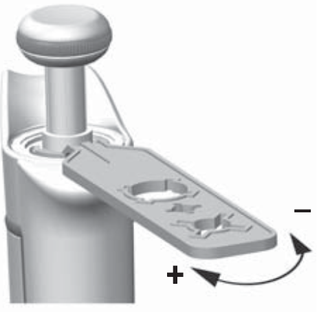

# Cleaning
## Waste categories
- Anything that touched bacteria are thrown into microbiological waste (solid or liquid).
- Glass / Broken glass: glass container
- Paper / plastic: recycling
- Gels: hazardous trash (needs a special sticker)
- Empty bottles / containers: hazardous trash (needs a special sticker)
- Anything else: common trash
## Miniprep tubes after growing cultures
- Add 9% bleach, shake and pour off to the sink.
- Rinse with dH2O and place the tubes in the rack next to the sink and the caps to the dishwasher container.
## Big culture flasks
- Rinse with dH2O and pour the contents into the biological waste bucket.
- Add 70% ethanol to cover the bottom of the flask, shake and pour off to the sink.
- Rinse with dH2O water.
- Autoclave prior to using.    
- Note: Never clean with Microbac as it is very hard to remove. If you accidentaly do, wash the flask several times with boiling water, then clean with ethanol as specified above.
## Cuvettes for OD measurements
- Rinse with dH2O and pour the contents into the biological waste bucket.
- Optionally, also do:
	- Sterilize with 70% ethanol.   
	- Rinse with dH2O again 
## Electroporation cuvettes
- Rinse with dH2O and pour the contents into the biological waste bucket.
- Sterilize with 70% ethanol.
- Rinse with dH2O again.
- Optional: Prior to using, sterilize under UV for 10-15 min.
## Finnpipette F1
[Instructions](https://assets.thermofisher.com/TFS-Assets/LCD/Instructions/F1-Instructions-For-Use-1508980.pdf) 

- Dismantle the pipette by pressing the ejector and rotating the tip cone counterclockwise to release it.
- The tip cone can be autoclaved at 121 C for 20 min. Let it cool down and dry fully for 2 hours.
- Calibration by weighing dH2O:
	- Pre-wet the tip a few times.
    - Do 10 pipettings with the minimum volume.
    - Do 10 pipettings with the maximum volume.
    - Average the results. The pipette is calibrated if you’re roughly 10% off for the minimal volume and 1% off for the maximal volume.
    - Otherwise, use the pipette calibration tool (a plastic tool that looks a bit like a miniature wrench) by placing it into the openings of the calibration nut at the top of the handle and turning it clockwise to increase the volume or counterclockwise to decrease the volume.

