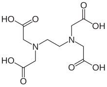
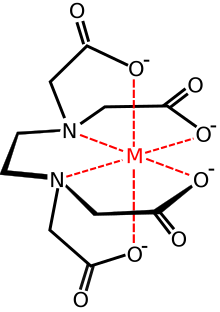
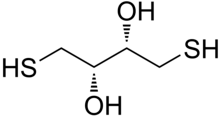
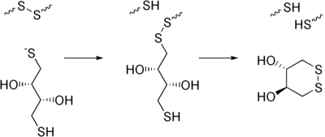
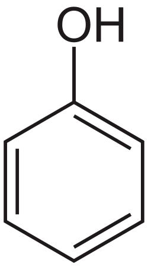

# Common chemicals
## Water
1. **Tap**:
	- pH varies significantly between locations
	- Can interfere with PCR, spectrometry/chromotagraphy, and protein biochemistry
	- Can leave impurities on containers
2. **Distilled (dH2O)** – vaporized and partially condensed water
	- Sterile initially, but bacteria can grow in it.
	- Can still contain CO2, ammonia, SiO2.
	- Suitable for general lab usage, e.g., cleaning glassware, preparing buffers, dialysis/
3. **Pure (RO)** – water filtered through a reverse osmosis membrane
	- Removes >95% ionic impurities.
4. **Double distilled (ddH2O)** – water after two distillations
5. **Deionized (diH2O)** – water without anions and cations
	- Purified using RO membranes / ion-exchange resin
	- Can contain some organic matter
	- pH varies as there are few ions
6. **Ultrapure (Milli-Q, NANOpure)**:
	- Uses deionized or RO water as input
	- Colloidal substances, gases, and organic matter at very low levels
	- Best for sensitive lab usage, e.g., PCR, HPLC, tissue cultures
7. **DEPC-treated:**
	- Water treated with .1% v/v diethyl pyrocarbonate for at least 2 hours at 37C, ten autoclaved for at least 15 min to inactivate traces for DEPC
	- RNAse-free
## Ethylenediaminetetraacetic acid (EDTA)
{width=50%}
{width=50%}

- Molar mass: 150.1 g/mol
- Molar mass of EDTA•2H2O: 186.1 g/mol
- Common stock solution: .5 M, pH 8.0
- Aminopolycarboxylic acid
- White
- Water insoluble solid
- Binds one Fe2+ / Fe3+ / Ca2+ / Mg2+ at neutral pH
- Dissolves Fe- and Ca-containing scale
- Delivers Fe ions
- Deactivates metal-dependent enzymes, thus helps protect DNA and proteins from degradation and inhibits dNTP hydrolyzing enzymes (e.g., DNA polymerase I)
- Also prevents enzymes from binding to unwanted metal ions (e.g., Pb+) that have a much higher affinity than Mg2+
## Dithiothreitol (DTT)

- Molar mass: 154.253 g/mol
- Organosulfur compound
- Colorless
- Dithiol / diol
- **Reducing agent:** once oxidized, it forms a stable six-membered ring with an internal disulfide bond
- Works at pH > 7
- **Prevents oxidation of thiol groups**
- **Reduces disulfide bonds** (between cysteines) in proteins – useful for stabilizing proteins as it prevents from unwanted sulfide bonds in reducing (often metal-ion-rich) environments.
- Can be used to denature proteins
- Oxidized by air, but rate is reduced at lower temperatures and lower pH
- Non-autoclavable
## Sodium dodecyl sulfate (SDS)
- Negatively charged detergent
- Denatures the protein by coating it evenly with a negative charge, stretching the protein out into a linear chain
- Non-autoclavable
## Beta-mercaptoethanol (beta-ME)

- **Reducing agent:** reduces disulphide bonds
- **Biological antioxidant**
- Non-autoclavable
## Tris(2-carboxyethyl)phosphine (TCEP)

- **Reducing agent:** breaks disuphide bonds
- Odorless
- More powerful than beta-ME and DTT, irreversible, more hydrophilic and more resistant to oxidation in air
## Urea

- Diamide of carbamic acid
- Colorless, odorless solid, highly soluble in water, neutral pH, practically non-toxic
- **Disrupts noncovalent bonds** in proteins
- Forms porous lattices that can trap many organic compounds
## Spermidine

- Polyamine
- Colourless liquid
- Found in ribosomes
- Maintains membrane potential
- Binds and precipitates DNA
- Used for in vitro transcription and translation
- Increases specificity and reproducibility of Taq-mediated PCR by neutralizing and stabilizing the negative charge on DNA phosphate backbone
- Used for electroporation
## Formamide

- Formid acid amide
- Colorless, oily liquid
- **RNA stabilizer** in electrophoresis by deionizing RNA
## Phenol

- Moderately polar solvent
## Dimethyl sulfoxide (DMSO)

- Polar aprotic solvent
## Chloroform

- Non-polar solvent
## Benzene

- Non-polar solvent