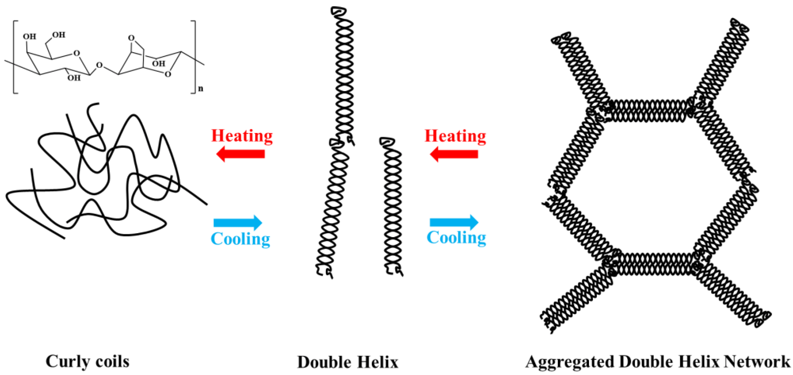

# Agarose gel electrophoresis
## Overview
Agarose gel forms when a solution containing disaccharide of D-galactose and 3,6-anhydro-L-galactopyranose cools down below 35C and non-covalent bonds allow a porous structure to form (100-300 nm size pores). Best used with DNA fragments >100 bp.

(Source: [Jiang et al., 2023](https://doi.org/10.3390/md21050299))
## Gel preparation

1. Choose gel percentage based on the DNA size that you want to resolve and measure **X g of agarose** to make X% (w/v) agarose gel (usually 1 or 2%):

| Gel % | DNA size range (bp) |
| ----- | ------------------- |
| .5    | 1000 - 30000        |
| .8    | 800 - 12000         |
| 1.0   | 500 - 10000         |
| 1.5   | 200 - 3000          |
| 2.0   | 50 - 2000           |

2. Mix agarose powder into **100 ml 1X TAE or TBE buffer** in a microwavable flask (while shaking the flask) and let it hydrate for a minute or two.
	- **TBE**: Best for smaller DNA fragments (<1500 bp), used with a higher voltage, can run for a longer time due to a higher buffering capacity
	- **TAE**: Best for larger DNA fragments (>4000 bp), used with lower voltage, good for purification from gel.
3. *(Optional)* Add **5 uL** of SYBR Safe to **prestain**.
	- **Only for linear fragments** because this dye acts as an **intercalator** and might alter plasmid migration, but should not affect linear fragments.
4. **Microwave for ~2 min** until the agarose is completely dissolved (can do 30-45 sec, stop and swirl, and then continue towards a boil). Just put it in a microwave and heat until it starts to bubble and once it does, take it out and then swirl, and if some crystals are left then heat it for a bit more.
5. Let agarose solution **cool down** to about 50°C (about when you can comfortably keep your hand on the flask), about **5 mins**.
6. **Pour** the agarose **into a gel tray** with the well comb in place. Make sure there are no bubbles – use a pipette tip to move them to the sides. Bubbles are most likely to appear near the comb.
7. Place newly poured gel at 4°C for 10-15 mins OR let sit at room temperature for 20-30 mins, until it has completely **solidified**.
## Running
1. Put the gel tray into the gel tank.
2. **Fill gel box** with 1X TBE (or TAE) until the gel is covered (important to use the same buffer).
3. **Add samples:**
   - **6 uL of sample with loading buffer:** 1 uL [TriTrack](https://www.thermofisher.com/order/catalog/product/R1161) + 5 uL DNA (mix and spin down)
   - **3 uL ladder** (mix gently)
4. **Run at 100V for 1% agarose gel (40 min) or at 120V for 2% agarose (30 min)**
    - Rule of thumb: 5-10 V/cm of gel. Small size gel is 7 x 10 cm, so 35-70 V, but people just use 100V.
    - It should start bubbling immediately.
    - In a few minutes, you should see some bands
    - At the end, the yellow die should be at the bottom of the well
5. Proceed to staining.
## Resources
- [Choosing the right agarose percentage for gel electrophoresis – miniPCR bio](https://www.minipcr.com/choosing-the-right-agarose-percentage/)