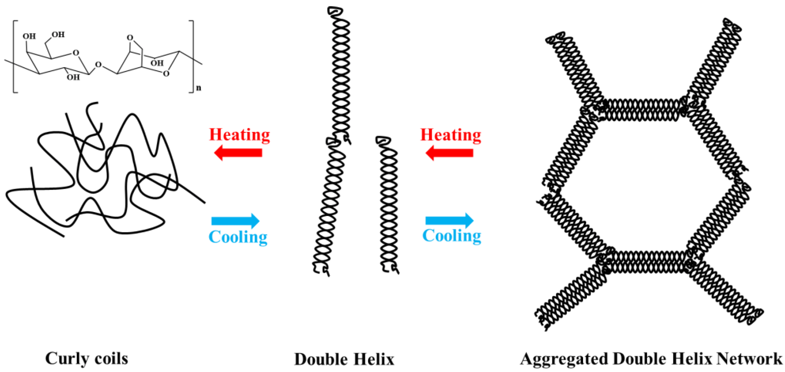

# Agarose gel electrophoresis

## Overview
Agarose gel forms when a solution containing disaccharide of D-galactose and 3,6-anhydro-L-galactopyranose cools down below 35C and non-covalent bonds allow a porous structure to form (100-300 nm size pores). Best used with DNA fragments >100 bp.

(Source: [Jiang et al., 2023](https://doi.org/10.3390/md21050299))

## Gel preparation

1. Choose gel percentage based on the DNA size that you want to resolve:

| Gel % | DNA size range (bp) |
| ----- | ------------------- |
| .50   | 1000 - 30000        |
| .75   | 800 - 12000         |
| 1.0   | 500 - 10000         |
| 1.5   | 200 - 3000          |
| 2.0   | 50 - 2000           |

2. Decide the number of samples you want to run and pick the required size of the gel.
	
| # samples | Tray size (cm x cm) | Vol. (mL) for 5 mm thickness |
| --------- | ------------------- | ---------------------------- |
| 8         | 7x7                 | 25                           |
| 8         | 7x10                | 35                           |
| 16        | 10x7                | 35                           |
| 16        | 10x10               | 50                           |

3. Weigh the required **agarose** amount (w/v).
	- E.g., for 1% gel, you'll want 1 g for 100 mL of buffer.
4. Mix agarose powder into **1X TAE or TBE buffer** in a microwavable flask (while shaking the flask) and let it hydrate for a minute or two.
	- **TBE**: Best for smaller DNA fragments (<1500 bp), used with a higher voltage, can run for a longer time due to a higher buffering capacity
	- **TAE**: Best for larger DNA fragments (>4000 bp), used with lower voltage, good for purification from gel.
5. **Microwave for ~2 min with the bottle cap only loosely holding** until the agarose is completely dissolved.
	- Do it in pulses: 30-45 sec microwave, stop and swirl (with a heat-resistant glove on), repeat until no more crystals are visible.
6. Let agarose solution **cool down** to about 50°C (about when you can comfortably keep your hand on the flask), about **5 mins**.
    - Place the bottle briefly under running tap water to speed up cooling, but don't overdo it!
7. *(Optional)* Add **5 uL** of [SYBR Safe](../12.06%20Staining/index.md#SYBR) to **prestain**.
	- **Only for linear fragments** because this dye acts as an **intercalator** and might alter plasmid migration, but should not affect linear fragments.
	- SYBR Gold is typically to sensitive and leads to overstained tracks.
8. **Pour** the agarose **into a gel tray** with the well comb in place.
	- Make sure there are no bubbles – use a pipette tip to move them to the sides. Bubbles are most likely to appear near the comb.
9. Place newly poured gel at 4°C for 10-15 mins OR let sit at room temperature for 20-30 mins, until it has completely **solidified**.
    - Cover with a piece of foil to avoid dust.
## Sample preparation
| # samples | Tooth width (mm) | Max. vol. (uL) for 1 mm comb | Minimal vol. (uL) |
| --------- | ---------------- | ---------------------------- | ----------------- |
| 8         | 5.5              | 25                           | 6                 |
| 16        | 3.5              | 16                           | 3                 |
1. Choose sample volume such that it would be visible when stained with SYBR Safe (need 50-100 ng of sample).
	- Narrower wells require proportionally less sample.
2. Mix with a [loading dye](../12.04%20Loading%20dyes/index.md) at the required proportion.
3. Choose an appropriate [ladder](../12.05%20Ladders/index.md).
	- Typically 2-3 uL suffice.
## Running
1. Put the gel tray into the gel tank.
2. **Fill gel box** with 1X TBE (or 1X TAE) until the gel is covered (important to use the same buffer).
3. Carefully **load the samples**.
	- Making sure they do not spill over. Lower the pipette tip into the well and slowly release the sample. Do not release any air bubbles at the end! It's better to keep a minute fraction of sample in the tip and throw it out.
	- Be careful not to puncture the bottom of the well.
4. **Run parameters:** Sample travel distance is
	- Proportional to voltage x time:
		- Higher voltage leads to more smearing.
		- Quick and dirty gels: 100-120V for 30-40 min.
		- Nice gels: 70-100V for 50-60 min.
	- Inverse proportional to exp(sample size (bp) x % agarose).
	- Inverse proportional to distance between electrodes (not gel length).
5. **Start the run**.
    - It should start bubbling immediately.
    - In a few minutes, you should see loading dye bands separating.
6. Proceed to **staining**.

## Resources
- [Choosing the right agarose percentage for gel electrophoresis – miniPCR bio](https://www.minipcr.com/choosing-the-right-agarose-percentage/)
- [multiSUB® Horizontal Electrophoresis Units](https://files.plytix.com/api/v1.1/file/public_files/pim/assets/9e/65/2f/5c/5c2f659ed1855f04664d45e8/texts/ef/7f/87/67/67877fef7f1754a21e9dd7c0/MULTISUB%20RANGE%20MANUAL.pdf)
