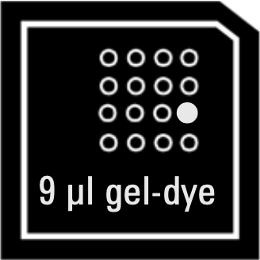
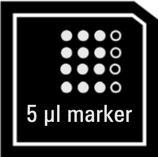

# Bioanalyzer
## Overview
- [Manual](https://www.agilent.com/cs/library/usermanuals/public/HighSensitivity_DNA_KG.pdf)
- Analysis time: 45 min
- Sample volume: 1 uL
- Sizes: 50-7000 bp
## Sample preparation  
- NGS sheared DNA or libraries: the total DNA in the samples must be between 100 pg/µL – 10 ng/µL.
- PCR samples: the total DNA in the sample must be between 5 – 500 pg/µL.
If the concentration of a sample is higher, dilute or use another Agilent DNA kit (Agilent DNA 1000, DNA 7500 or DNA 12000).
Samples should be diluted in a lo-bind tube.
## General guidelines
- Always **insert the pipette tip to the bottom of the well** when dispensing the liquid. Placing the pipette at the edge of the well may lead to poor results.
- **Use loaded chips within 5 min after preparation**. Reagents might evaporate, leading to poor results. 
- Keep all reagents and reagent mixes refrigerated at 2-8 °C when not in use.
- Allow all reagents and samples to equilibrate to room temperature for 30 min before use.
- Protect dye and dye mixtures from light. Remove light covers only when pipetting. The dye decomposes when exposed to light and this reduces the signal intensity.
- Do not touch the 2100 Bioanalyzer instrument during analysis and never place it on a vibrating surface.
## Initial preparation
### Preparing the Gel-Dye Mix 
1. Allow High Sensitivity DNA dye concentrate and High Sensitivity DNA gel matrix to equilibrate to room temperature for 30 min. 
2. Add 15 µL of High Sensitivity DNA dye concentrate to 300 uL High Sensitivity DNA gel matrix  vial.
3. **Vortex** solution well and spin down. Transfer to spin filter.
4. Centrifuge at **2240 g** ± 20 % for 15 min.
	- Protect solution from light.
	- Store at 2-8 °C.
	- Use prepared gel-dye mix within 6 weeks of preparation.
### Starting the software
1. Start the BioAnalyzer software and power on the device itself. All tick marks at the bottom right should be green except for the one that indicates the presence of a chip.
### Cleaning BioAnalyzer
1. Slowly fill one of the wells of the electrode cleaner with 350 μL deionized analysis-grade water.   
2. Open the lid and place the electrode cleaner in the 2100 Bioanalyzer instrument.   
3. Close the lid and leave it closed for about 10 seconds.    
4. Open the lid and remove the electrode cleaner.    
5. Wait another 10 seconds to allow the water on the electrodes to evaporate before closing the lid.
## Running
### Loading the Gel-Dye Mix 
1. Allow the gel-dye mix to **equilibrate** to room temperature for **30 min** before use.
	
2. Put a new High Sensitivity DNA chip on the **chip priming station**.
3. Pipette **9 µL of gel-dye mix** in the well marked G (G in a black circle).
4. Make sure that the **plunger** is positioned at **1 mL** and then close the chip priming station.
5. **Press plunger** until it is held by the clip.
6. Wait for **exactly 60 s**, then release clip.
7. Visually inspect that the plunger moves back at least to the 0.3 mL mark.
8. **Wait for 5 s**, then **slowly pull back** the plunger to the 1 mL position.
9. Open the chip priming station and pipette **9 µL** of gel-dye mix in the wells marked **G** (no background color).
	
### Loading the Marker 
1. Pipette 5 µL of marker (green) into all 11 sample wells and a ladder well (**marked with a ladder symbol)**. Do not leave any wells empty. 
	
### Loading the Ladder and Samples 
1. Pipette **1 µL** of High Sensitivity DNA ladder (yellow) in the well marked with the **ladder symbol**.
	
2. In each of the 11 sample wells pipette **1 µL of sample (used wells) or 1 µL of marker (unused wells)**.
	
3. Put the chip horizontally in the shaker and **vortex for 1 min** at **2400 rpm**.
4. Run the chip in the 2100 Bioanalyzer instrument within 5 min.
### Running
1. Load the chip and carefully close the lid.
2. Make sure all tick marks at the bottom right of the software are green.
3. Click Assays and choose the appropriate assay based on the kit you used to prepare your samples.
4. Accept the default file prefix (2100 expert).
5. Enter sample names in the table.
6. Click **Start**. It will take about 5-10 min to show the first traces.
	1. In case a low/high voltage error appears in one or a few wells, you may try adding more sample or more gel-dye matrix.
	2. The run takes about 45 min.
7. Immediately remove the chip after the run. Do not leave it overnight as it may cause contamination of electrodes.
8. Export with the default settings (need CSV files of the raw data and sample traces).
## Reusing the chip
[gene-quantification.de/nguyen-et-al-chip-reuse-rna-integrity-2014.pdf](https://www.gene-quantification.de/nguyen-et-al-chip-reuse-rna-integrity-2014.pdf)