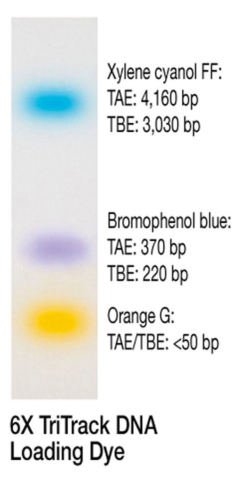

# Loading dyes
Loading dyes are mixed this samples to pull them down into a well in a gel and to visually track migration during electrophoresis.

When using **fluorescently-labelled (Cy3, Cy5)** samples, make sure the tracking dyes **do not co-migrate with your sample**, otherwise you may be unable to tell if a resulting band originates from your sample or the dye.

For **native PAGE**, do not use dyes that contain **SDS** as they may separate double-stranded nucleic acids.

## Common dyes (separate)

### Bromophenol blue

- 3′,3″,5′,5″-tetrabromophenolsulfonphthalein (BPB)
- Below pH 3.5: yellow
- Above pH 4.6: blue
- Slightly negative
- 1% agarose gel in TAE or TBE: co-migrates with 300 bp DNA
- 2% agarose gel in TAE or TBE: co-migrates with 150 bp DNA
### Xylene cyanol 

 
 - 1% agarose gel: co-migrates with 4-5k bp DNA
 - 6% polyacrylamide gel: co-migrates with 140 bp DNA
 - 20% denaturating (7 M urea) PAGE: 25 bp DNA
### Orange G
- Orange in pH < 8
- Red in pH > 9

## Common dye mixes
### TriTrack
[Source](https://assets.thermofisher.com/TFS-Assets/LSG/manuals/MAN0013168_6X_TriTrack_DNA_Loading_Dye_UG.pdf)

- Contents:
	- 10 mM Tris-HCl (pH 7.6)
	- 0.03 % bromophenol blue
	- 0.03 % xylene cyanol FF
	- 0.15 % orange G
	- 60 % glycerol
	- 60 mM EDTA.
- Uses:
	- Agarose gel
	- Native PAGE
### Gel Loading Buffer II
[Source](https://assets.thermofisher.com/TFS-Assets%2FLSG%2Fmanuals%2Fsp_8547.pdf)

- 1-2X solution
- Contents:
	- 95% Formamide
	- 18 mM EDTA
	- 0.025% each of SDS, Xylene Cyanol, and Bromophenol Blue
- Uses:
	- Denaturing PAGE
	- Non-denaturing agarose gel
- Appearance: Dark blue

Protocol:

1. Mix sample with an equal volume of Gel Loading Buffer II. Vortex briefly.
2. Centrifuge briefly to bring contents of tubes to the bottom.
3. For denaturing PAGE: Heat to 95°C for 5 min to denature any secondary structure.
4. Load directly (while still hot) on the gel.
### RNA Loading Dye
[Source](https://www.neb.com/en/protocols/0001/01/01/protocol-for-denaturing-page-urea-or-denaturing-agarose-gel-b0363)

- 2X
- Contents:
	- 47.5% Formamide
	- 0.01% **SDS**
	- 0.01% bromophenol blue
	- 0.005% xylene cyanol
	- 0.5 mM EDTA
- Uses:
	- Denaturing PAGE

Protocol:

1. Add sample to an equal volume of RNA Loading Dye, (2X). Mix well.
2. Heat at 65–70°C for 5–10 minutes to denature RNA.
3. While heating the samples, setup the gel box and flush urea out of the wells with running buffer using a large tip.
4. Load samples.