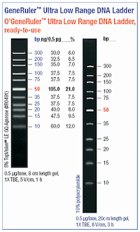
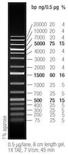

# Ladders
## GeneRuler Ultra Low Range
 [GeneRuler Ultra Low Range](https://assets.thermofisher.com/TFS-Assets%2FLSG%2Fmanuals%2FMAN0013039_GeneRuler_Ultra_LowRange_DNALadder_50ug_UG.pdf)

## GeneRuler 1kb Plus
[GeneRuler 1kb Plus](https://assets.thermofisher.com/TFS-Assets%2FLSG%2Fmanuals%2FMAN0013050_GeneRuler_1kb_Plus_DNALadder_RTU_50ug_UG.pdf) 

## Low Range ssRNA Ladder
[Low Range ssRNA Ladder \| NEB](https://www.neb.com/en/products/n0364-low-range-ssrna-ladder)

### Storage Buffer
20 mM sodium citrate  
1 mM EDTA  
pH 6 @ 25°C
### Procedure
1. Combine:
	- 2 µl of Low Range ssRNA Ladder
	- 38 µl of (2X) RNA Loading Dye
2. Incubate 2.5 uL at **90˚C for 3-5 min**
3. Immediately place it on ice for 1-2 minutes
4. Load denatured ladder on the gel
