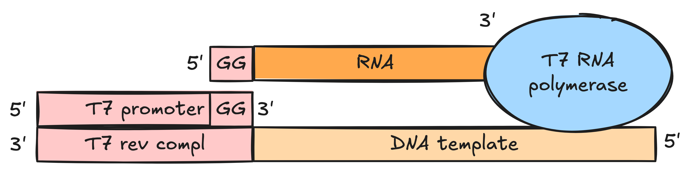

# In-vitro transcription
## Common RNA polymerases (RNAPs)

- Derived from bacteriophages
- ~900 aa
- ~100 kDa
- All RNAPs very similar biochemically
- Can transcribe from ssDNA, but typically dsDNA is used
- Can transcribe 30-10000 nt sequences
- Do not require any transcription factors
- Very specific to their own promoter
- T7 RNAP is strongly inhibited by T7 lysozyme; resistant to antibiotics (e.g., rifampicin)

| RNA polymerase | Origin species         | Promoter (nontemplate strand)    | Class | Speed at 37C (nt/s) | Size (kDa) | Comments                |
| -------------- | ---------------------- | -------------------------------- | ----- | ------------------- | ---------- | ----------------------- |
| T7             | E. coli                | TAA TAC GAC TCA CTA TA**G GG**   | III   | 200-300             | 99         |                         |
|                |                        | TAA TAC GAC TCA CTA TT**A GG**   | II    | 200-300             | 99         | Used for ApG initiation |
| T3             | E. coli                | AAT TAA CCC TCA CTA AA**G GG**   |       | 200-300             |            |                         |
| SP6            | Salmonella typhimurium | ATT TAG GT/GG ACA CTA TA**G AA** |       |                     |            |                         |
**Transcription product:**
- Starts at the first bold nucleotide in the table above; the first two GG's are critical for T7
- Has 3 phosphates at 5' end: 5'-ppp**GGG**...

**Transcription template:**
- Plasmid – best for high yields; must linearize for a run-off transcription
- PCR product
	- Digest 3' end such that DNA template on the antisense strand would end exactly where you want RNA to end
	- Can also use any DNA fragment by amplifying it using an extended 5' primer that has a T7 promoter
- Two annealed oligos (**only the promoter part needs to be double-stranded**) – for short transcripts

Must be as pure as possible (no RNases, SDS, EDTA, proteins, RNA). T7 and SP6 RNA Polymerases are also inhibited by ~50% at
NaCl or KCl concentrations above 150 mM and T3 RNA Polymerase at above 250 mM.

**Terminators:**
- **Rho-dependent terminator** that forms a 7-20 base pair hairpin, followed by a U-rich stretch
- **Run-off** where RNAP falls off at the end of the template
	- T7 might incorporate one or several non-templated nucleotides at 5' end

**Errors:**
- 5':
	- More G inserted if 5-6 G's are present at 5' of the template
	- Might skip 1-2 nucleotides or add an additional purine if the template starts with CAC/G
	- Can be remedied by adding a 5' Hammerhead ribozyme 
- 3':
	- Run-off transcription might incorporate one or several additional nucleotides
	- Remedied by a 3' HDV ribozyme; works even at low Mg2+ concentrations; however, RNAs secondary structure might hinder self-cleavage – optimize pH, temperature, and salt conditions
- Short abortive transcripts (9-12 nt) during initiation. Thus, if doing radioactive labelling, avoid using (alpha32-P)GTP as 5' tail is G-rich and your GTP resource might be depleted too fast.

**Modifications:**
- 5'-OH: Initiate with guanosine
- 5'-monophosphate: Initiate with GMP. Monophosphates are easier to dephosphorylate than triphosphates
- 5' cap: Initiate with ApG or 7-methylguanosine
### Resources
[Synthesis of RNA by In Vitro Transcription | SpringerLink](https://link.springer.com/protocol/10.1007/978-1-59745-248-9_3)

## Basic protocol
- [Lin et al., 2022](https://doi.org/10.21769/BioProtoc.4420)
- [Optimized protocols for the characterization of Cas12a activities](https://pmc.ncbi.nlm.nih.gov/articles/PMC10403974/)

1. Make a 10X transcription buffer:

| Component                       | Amount (uL)                                | Final conc. (mM) | Stock conc. |
| ------------------------------- | ------------------------------------------ | ---------------- | ----------- |
| Milli-Q                         | =b7 - sum(b3:b6)                           |                  |             |
| Tris-HCl, pH 8.0 (M)            | =b7 \* (+1c+0r) / (1000 \* (+2c+0r)) \* 10 | 40               | 1           |
| MgCl2 (M)                       | =b7 \* (+1c+0r) / (1000 \* (+2c+0r)) \* 10 | 20               | 1           |
| Spermidine (M)                  | =b7 \* (+1c+0r) / (1000 \* (+2c+0r)) \* 10 | 1                | .5          |
| RiboLock RNase Inhibitor (U/uL) | =b7 \* (+1c+0r) / (+2c+0r) \* 10           | 1                | 40          |
| **Total**                       | **100**                                    |                  |             |

2. Mix the following components at room temperature.
	- Add up to 11 uL of the template DNA, filling the remaining volume with RNAse-free water.
	- Pyrophosphatase cleaves the insoluble magnesium pyrophosphate into phosphate.
	- Mg2+ concentration should be about 5 mM higher than the total rNTP concentration (since each rNTP chelates one Mg2+).
	- Reaction can be scaled either by adding more concentrated DNA template or by scaling reaction volume.
	- Free RNA polymerase might be added later in the reaction to increase the yield.

| Component                        | Amount (uL)      | Stock conc. | Final. conc.                |
| -------------------------------- | ---------------- | ----------- | --------------------------- |
| 10X Transcription buffer         | =b12 / 10        | 10          | =(-2c+0r) \* (-1c+0r) / b12 |
| ATP (mM)                         | 1                | 100         | =(-2c+0r) \* (-1c+0r) / b12 |
| CTP (mM)                         | 1                | 100         | =(-2c+0r) \* (-1c+0r) / b12 |
| GTP (mM)                         | 1                | 100         | =(-2c+0r) \* (-1c+0r) / b12 |
| UTP (mM)                         | 1                | 100         | =(-2c+0r) \* (-1c+0r) / b12 |
| DTT (mM)                         | 1                | 100         | =(-2c+0r) \* (-1c+0r) / b12 |
| DNA template                     |                  |             |                             |
| Inorganic pyrophosphatase (U/uL) | 1                | .1          | =(-2c+0r) \* (-1c+0r) / b12 |
| T7 RNA polymerase (U/uL)         | 1                | 20          | =(-2c+0r) \* (-1c+0r) / b12 |
| RNAse-free dH2O                  | =b12-sum(b2:b10) |             |                             |
| **Total**                        | **20**           |             |                             |

3.  Incubate for 2-16 h at 37C.
4. *(Optional)* If you want to remove DNA template, add 1 uL DNAse I and incubate at 37C for 30 min.
	- If you have high amounts of DNA template (e.g., highly-concentrated linear template or a plasmid), consider adding more DNAse or increase the duration of incubation.
	- You don't need to heat-deactivate it if proceeding directly to purification.
### Notes
- **Expected yield of the purified product:** ~100 ng/uL = ~4 uM (i.e., 10-20X more than template DNA)
- **Does the amount of DNA template matter?** When comparing IVT yields by adding either 286.4 fmol or 2864 fmol of DNA template, we got 3 uM vs 17 uM of a purified product. When adding either 400 fmol or 2.5 pmol (6.25 times more) of DNA template library (12k members), we got 2.75 times more product.  So yes, more template helps, though non-linearly.
- **Is RNase inhibitor required for the buffer?** It looks like a lot of labs don't use it, but the salts used in the transcription buffer are not guaranteed to be RNAse-free, so adding an inhibitor sounds like a good idea.

## MEGAscript
[MEGAscript](https://assets.thermofisher.com/TFS-Assets%2FLSG%2Fmanuals%2F1330M_G.pdf)

Required **template DNA**: .5-2 pmol. Typically this translates into the following amounts:
- PCR-product template: 0.1–0.2 μg
- Linearized plasmid template: ~1 μg (assuming plasmid size of about 5.5 kbp with a 1.85 kbp gene)
- If the template is short (≤500 bp) and within a plasmid, it may not be possible to have enough of it within the volume limits and also large DNA amounts might be detrimental to the reaction. Consider cutting out the template from the plasmid.
### Procedure
1. If starting with a circular template, you must **linearize** it as RNA polymerase is very processive. (DNA generated by PCR can be transcribed directly from the PCR). Purify the template using [index](../../13%20Purification/13.01%20DNA%20purification/index.md) – Ethanol precipitation.
2. **Thaw** all frozen reaction components, **mix** and **centrifuge** briefly to collect all drops.
	- **10X Reaction Buffer:** thaw, vortex, spin down, and keep at **room temperature.**
		- Contains salts, buffer, dithiothreitol, and other ingredients
	- **Ribonucleotide solutions (ATP/CTP/GTP/UTP):** thaw, vortex, spin down, and keep **on ice.**
3. Combine the following reaction components **at** **room temperature** in the order given:

| Reagent             | uL                           | ng/uL | pmol |
| ------------------- | ---------------------------- | ----- | ---- |
| Nuclease-free water | =b10 - sum(b3:b9)            |       |      |
| ATP solution        | 2                            |       |      |
| CTP solution        | 2                            |       |      |
| GTP solution        | 2                            |       |      |
| UTP solution        | 2                            |       |      |
| 10X Reaction Buffer | 2                            |       |      |
| Template DNA        | =(+2c+0r)/(+1c+0r)\*2912/1.6 | 113.3 | .5   |
| Enzyme Mix          | 2                            |       |      |
| **Total**           | 20                           |       |      |

4. Gently flick the tube, spin down briefly, and **incubate in a thermocycler at 37°C for 2-4 h**. For short (≤500 bp) transcripts incubate **4-6 h** and **up to 16 h**.
5. Add **1 μL (2U) [TURBO DNase**](https://assets.thermofisher.com/TFS-Assets%2FLSG%2Fmanuals%2F4393900B.pdf), mix well and incubate **30 min at 37°C**
	- "One unit is the amount of enzyme required to completely degrade 1 μg DNA in 10 min at 37°C". Assuming the length of 3000 nt of DNA, 1 ug = .5 pmol, so 1 uL of DNAse I will degrade 1 pmol of template DNA in 10 min.
	- Heat inactivation (only required if not proceeding to purification):
		- Phenol/chloroform extraction, or
		- Add EDTA for a final concentration of 15 mM and heat at 75C for 10 min. Without EDTA, RNA will undergo chemical scission when heated.

### Expected yield
100 ug per 20 uL = 8 uM

If yield is low, it may be due to residual RNases or other inhibitors from miniprep or digestion. Thus:
- Treat the template DNA with proteinase K (100–200 μg/mL) and 0.5% SDS for 30 min at 50°C
- Perform phenol/chloroform extraction (using an equal volume) and ethanol precipitation.

## TranscriptAid T7 High Yield Transcription Kit
[TranscriptAid](https://assets.thermofisher.com/TFS-Assets/LSG/manuals/MAN0012652_TranscriptAid_T7_High_Yield_Transcription_UG.pdf)
1. **Thaw** all frozen reaction components, **mix** and **centrifuge** briefly to collect all drops.
	- Keep TranscriptAid **Enzyme Mix and nucleotides on ice**.
	- Keep the 5X TranscriptAid Reaction **Buffer at room temperature**.
2. Combine the following reaction components at room temperature in the order given:

| Component                        | Amount |
|----------------------------------|--------|
| Template DNA                     | 1 ug   |
| DEPC-treated water               | 6 uL   |
| 5X TranscriptAid Reaction Buffer | 4 uL   |
| ATP/CTP/GTP/UTP mix              | 8 uL   |
| TranscriptAid Enzyme Mix         | 2 uL   |

3. Mix thoroughly, spin briefly to collect all drops and **incubate in a thermocycler at 37°C for 2 h**.
	- For short (≤100 nt) transcripts incubate **4-8 h** at 37°C.