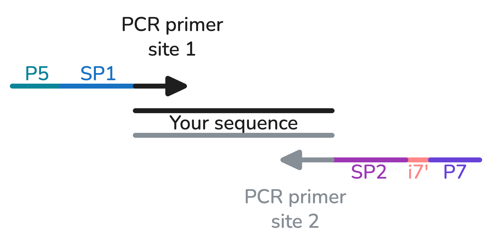
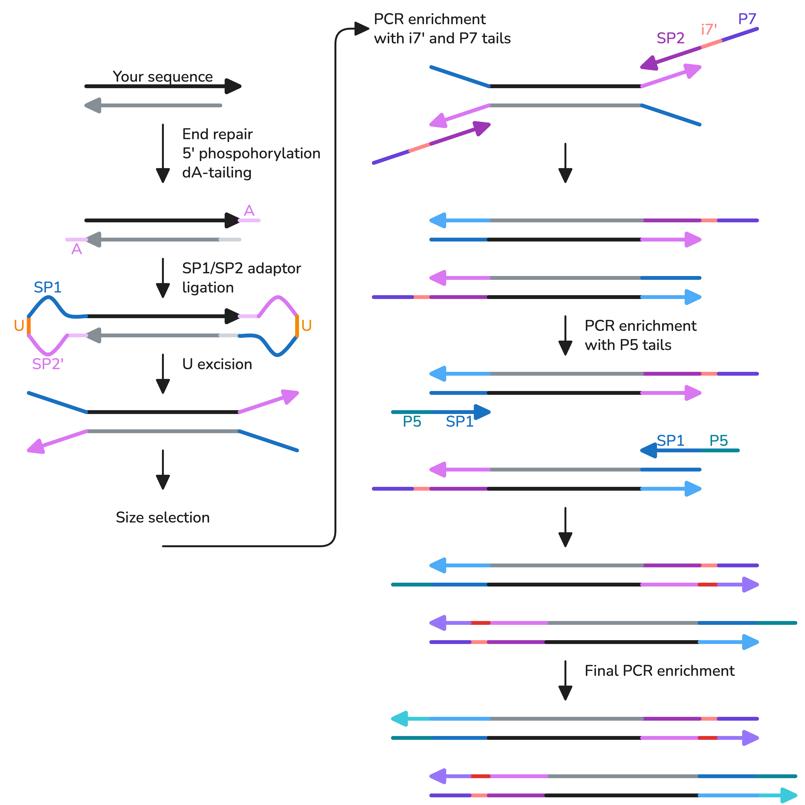
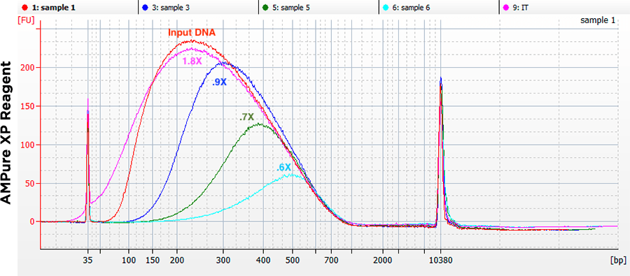
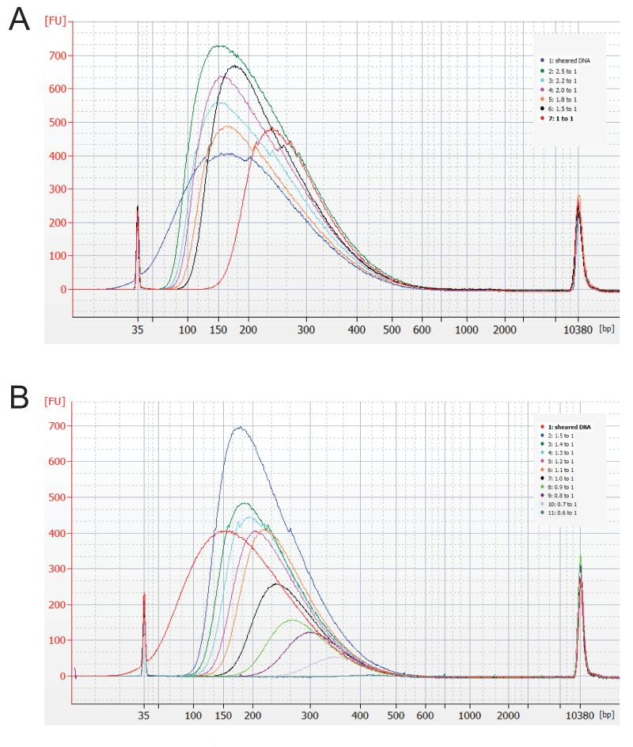
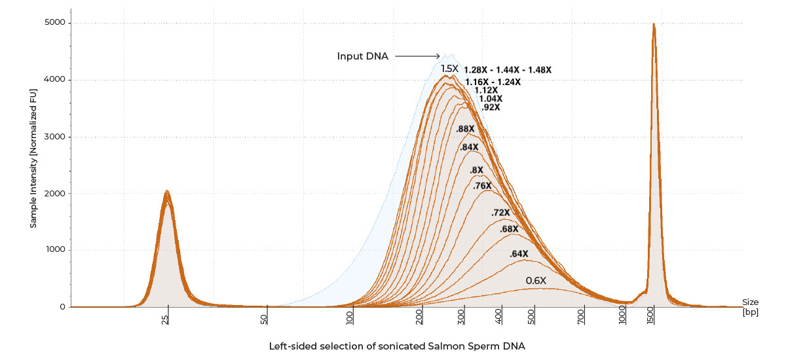

# DNA NGS preparation
## Sequencing options
- **Sanger** sequencing
- **Illumina** – for short reads. Can be done either at our core facility or sent to EMBL's Genecore. Options:
	- NextSeq: 2 x 100 bp reads (most common)
	- MiSeq: 2 x 150 bp reads, but fewer samples and reads than NextSeq
- Oxford **Nanopore** – for long reads (but few reads overall). Typically done for whole plasmids and amplicons via [SeqVision](https://seqvision.com/).
- **PacBio** – for long reads. Can be done at out core facility.
## Illumina sequencing overview
Illumina sequencing works by immobilizing your sample DNA on a flowcell and then running a synthesis of a complementary strand just like during PCR. Since each nucleotide is fluorescently labelled, we can observe which nucleotides are added to the nascent DNA strand and infer to original DNA sequence.

Preparation for Illumina sequencing requires to add the following sequences to your DNA samples:
- **P5** and **P7** sequences that attach to the flowcell during sequencing;
- **Index 1** (**i7**) and (optionally) **Index 2** (**i5**; not shown in the diagram) that uniquely identify your sample among other samples during the sequencing run (typically, more than one sample is run at a time)
	- Having both indices increases multiplexing capacity and demultiplexing accuracy;
	- In practice we stick to i7;
- **SP1** and **SP2** sequences where the primers attach for the PCR reaction.
	- SP1 is the Sequencing Primer for the first read that you receive in the resulting FASTA file, and SP2 is for the second read.

**P5 and SP1** form a **Universal Adapter** (it is universal because it has no index and can be reused for all your samples in a pool).

**P7, i7, and SP2** from an **Indexed Adapter** (because it has a sample-specific index of your choice).

Illumina offers many kits that differ in their properties. We typically use NextSeq kits with paired-end reads (150 nt each). Pair-end sequencing means that sample DNA is read in one direction, then in another, allowing you to get longer sequences or, if the two reads overlap, better base calling accuracy.
### Resources
- [Improved Protocols for Illumina Sequencing – Bronner et al., 2009](https://pmc.ncbi.nlm.nih.gov/articles/PMC3849550/)
- [Sequencing Overview – Illumina](https://cbiit.github.io/brownbag-science/02-sequencing/Illumina_Sequencing_Overview_15045845_D.pdf)
- [About Illumina sequencing libraries – Teichmann's group at University of Cambridge](https://teichlab.github.io/scg_lib_structs/methods_html/Illumina.html)
- [Understanding Illumina TruSeq Adapters – Tufts University Core Facility](http://tucf-genomics.tufts.edu/documents/protocols/TUCF_Understanding_Illumina_TruSeq_Adapters.pdf)
- [Illumina Sequencing Overview – Center for Biomedical Informatics and Information Technology (CBIIT)](https://cbiit.github.io/brownbag-science/02-sequencing/Illumina_Sequencing_Overview_15045845_D.pdf)
- [Cluster Generation – Broad Institute](https://www.broadinstitute.org/files/shared/illuminavids/clusterGenSlides.pdf)
- [A Visual Guide to DNA Sequencing – Asimov Press](https://www.asimov.press/p/dna-sequencing)
## Illumina sample preparation via PCR in NextSeq style
An easy way to prepare samples for NGS is to amplify your DNA with primers that already contain the required adaptors and barcodes.

### Forward primer
- **P5:** AATGATACGGCGACCACCGAGATCT
- **SP1:** ACACTCTTTCCCTACACGACGCTCTTCCGATCT
- **PCR primer site 1:** Primer for amplifying your DNA sequence from your plasmid.
### Reverse primer
- **P7:** CAAGCAGAAGACGGCATACGAGAT
- **i7':** NNNNNN – A **unique 6 or 8 nt** barcode
	- Must be unique across all samples that are submitted for sequencing.
	- This sequence is a **reverse complement** to the barcode that you provide to the sequencing service and what you would actually see in your reads.
	- If you need an **8 nt index** but already have oligos with a 6 nt index, add **AT from P7**, meaning that i7' is ATNNNNNN, and thus the barcode to expect during sequencing is N'N'N'N'N'N'AT.
- **SP2:** GTGACTGGAGTTCAGACGTGTGCTC-TTCCGATCT
	- The last 9 nt (after the dash) are optional in this design
- **PCR primer site 2:** Primer for amplifying your DNA sequence from your plasmid.
### PCR primer design details
- You want to have primers end with **one or two G's or C's**, but not more.
- Check in Benchling for primer dimers. If **delta G < -7 kcal/mol**, this is already becoming risky.
- **Sequence diversity** will be low at the beginning for each read. Consider adding **PhiX** to resolve chip failures or pool with other samples that are prepared in a different way.
## NEBNext Ultra II DNA Library Prep Kit for Illumina
### Overview

NEBNext Adaptor for Illumina sequence is 5'-SP2'-dU-SP1-3' (66 nt):

ACACTCTTTCCCTACACGACGCTCTTCCGATC-s-T - 3´
**dU**
CTGACCTCAAGTCTGCACACGAGAAGGCGAT-/5Phos/ - 5'

where **-s-** is a phosphorothioate bond, a kind of a very strong bond so that T is not accidentally trimmed off before the adapter ligates.

During PCR barcoding, 5'-P7-i7'-SP2-3' and 5'-P5-SP1-3' are used as primers for amplification.

The final sequences that we **submit for sequencing** are:

- 5'-P7-i7'-SP2-Sequence'-SP1'-P5'-3'
- 5'-P5-SP1-Sequence-SP2'-i7-P7'-3'
- 5'-P5-SP1-Sequence'-SP2'-i7-P7'-3'
- 5'-P7-i7'-SP2-Sequence-SP1'-P5'-3'

where:

- **P5:** AATGATACGGCGACCACCGAGATCT (25 nt)
- **SP1:** ACACTCTTTCCCTACACGACGCTCTTCCGATCT (33 nt);
- **i7':** Reverse complement of the barcode you submit to the sequencing service and use for analyses (8 nt)
- **SP2:** GTGACTGGAGTTCAGACGTGTGCTCTTCCGATCT (34 nt)
- **P7:** CAAGCAGAAGACGGCATACGAGAT (24 nt).

Thus, the reads will show either your original sequence or a reverse complement of it.
#### Resources
- [NEBNext Ultra II protocol](https://www.neb.com/en/-/media/nebus/files/manuals/manuale7103-e7645.pdf?rev=de09eaf8fcdf45e0ac8a66bf6fee75fb&hash=FC51B96E7568B4482CF1B5217EF04E31)
- [NEBNext® Multiplex Oligos for Illumina® (Index Primers Sets 1– 4)](https://www.neb.com/en/-/media/nebus/files/manuals/manuale7500.pdf?rev=85c8e2b347844ca58281c17372fdcec4&hash=DA80FEE9917B41B5601425B44E60250F)
- [NEBNext® Multiplex Oligos for Illumina® (96 Index Primers)](https://www.neb.com/en/-/media/nebus/files/manuals/manuale6609.pdf?rev=9099f513158844a99030168ab2151f4f&hash=0AC74DC8AEDBDA2A78B65E69D9EC0337)
### General sample preparation guidelines
- All **pipetting up and down** must be done at least **10 times** to mix very well. The presence of a small amount of bubbles will not interfere with performance.
- Always spin down PCR tubes after incubation in a thermocycler for 1 min. Use the fixed-speed microcentrifuge that you typically use to spin down tubes.
### Sample Tracking Sheet

| Step              | Qubit concentration (ng/uL) | Vol. (uL) | Milli-Q  | Amount (ng) | Notes                                |
| ----------------- | --------------------------- | --------- | -------- | ----------- | ------------------------------------ |
| End repair        | [C1]                        | V         | to 50 uL | [C1] x V    | Ideally 1 ug, but no less than .5 ng |
| Barcoding         | [C2]                        | 15        | -        | [C2] x 15   | Barcode:                             |
| Final preparation | [C3]                        | 19        |          | [C3] x 19   |                                      |

### End repair (90 min)

*Purpose: Repair dsDNA ends so that they become blunt and 5’-phosphorylated and also add dA on one end to facilitate adaptor ligation in the next step.*

1. Get sample concentrations using Qubit High Sensitivity kit and record them in the Sample Tracking Sheet.
2. Transfer between .5 ng and 1 ug (ideal) of DNA to PCR tubes and adjust volume to 50 uL with Milli-Q.
3. Prepare master mix **on ice** in a .5 mL LoBind tube and pipette it **gently** up and down:

| Component                                                 | Per reaction (uL) | Per reaction + 5% (uL) |
| --------------------------------------------------------- | ----------------- | ---------------------- |
| End Prep Reaction Buffer | 7                 | 7.35                   |
| End Prep Enzyme Mix      | 3                 | 3.15                   |
| **Total**                                                 | 10                | 10.5                   |

4. Add **10 uL of master mix** to each DNA sample and pipette up and down.
5. **Incubate** in a thermocycler (60 uL):

| Step                | Temperature | Time (min) |
| ------------------- | ----------- | ---------- |
| Incubation          | 20          | 30         |
| Enzyme inactivation | 65          | 30         |
| Hold                | 4           | Hold       |

6. **Spin down** for 1 min.

### Adaptor ligation (45 min)

*Purpose: Ligate adaptors (SP1 and SP2) to both ends of the dsDNA sample.*

1. Thaw [NEBNext Adaptor Dilution Buffer](https://www.neb.com/en/products/b1430-nebnext-adaptor-dilution-buffer).
2. In the meantime, prepare Master Mix **on ice** in a  .5 mL LoBind tube:

| Component                                                | Per reaction + 10%(uL) |
| -------------------------------------------------------- | ---------------------- |
| NEBU2 Ligation Master Mix | 15.4                   |
| NEBU2 Ligation Enhancer   | 1.1                    |

3. Add **15 uL of Master Mix** to each DNA sample.
4. Dilute NEBNext Adaptor (from the Index Kit) with NEBNext Adaptor Dilution Buffer according to the DNA amount you have, making sure the final diluted volume is sufficient for all your samples (you'll need **2.3 uL** per sample of **diluted NEBNext Adaptor**).

| DNA amount (ng) | Dilution |
| --------------- | -------- |
| <5              | 25X       |
| 5-100           | 10X       |
| 101-1000        | No dilution        |

5. Add **2.3 uL of NEBNext Adaptor (diluted, Step 4)** to each sample, pipette up and down **gently** and spin down.
6. **Incubate for 15 min** at room temperature or an open-lid thermocycler set to 20C.
7. Add **3 uL of USER enzyme** and gently pipette.
8. Incubate in a thermocycler (80.3 uL):

| Step       | Temperature | Time (min) | Lid temperature |
| ---------- | ----------- | ---------- | --------------- |
| Incubation | 37          | 15         | 47              |
| Hold       | 4           | Hold       |                 |

14. Spin down for 1 min.
	- You may take a break here and store samples at -20C until ready.
### Magnetic bead purification (45 min)

*Purpose:
- _**Round 1:** Reduce the amount of adaptor dimers in the sample._
- _**Rounds 2 and 3:** Reduce the amount of samples without barcodes and purify._

1. Let the magnetic beads thaw to **room temperature**, then vortex.
2. Transfer PCR products to a new 1.5 mL tube.
3. Choose bead/sample **ratio** based on the your fragment size in the chart below.
	- After adaptor ligation, the fragment size increases by 66 nt
	- After barcoding, another 56 nt are added
	- For [AMPure XP beads](https://www.beckman.com/reagents/genomic/cleanup-and-size-selection/pcr/bead-ratio):
		
			(source: Bronner et al., 2009)
	- For [Zymo Select-a-size MagBeads](https://files.zymoresearch.com/protocols/_d4084_d4085_select-a-size_dna_clean_concentrator_magbead_kit.pdf):
		

| Round | Input from                          | Size (nt)         | Input vol (uL) | Bead vol. (uL) | Amount of water for resuspention (uL) | Amount of sample to transfer (uL) |
| ----- | ----------------------------------- | ----------------- | -------------- | -------------- | ------------------------------------- | --------------------------------- |
| **1** | Adaptor ligation                    | Sample size + 67  | 80.3           | 80.3 x ratio   | 23                                    | 20                                |
| **2** | Barcoding                           | Sample size + 117 | 50             | 50 x ratio     | 53                                    | 50                                |
| **3** | Magnetic bead purification, Round 2 | Sample size + 117 | 50             | 50 x ratio     | 23                                    | 20                                |

3. Add the computed **bead amount** to each sample and pipette up and down.
4. **Incubate** at room temperature for 5 min.
5. In the meantime, make fresh **80% ethanol** (need 200 uL x 2 times x 3 rounds = 1.2 mL per sample):

| Component    | Per reaction + 5% (mL) |
| ------------ | ---------------------- |
| 100% ethanol | 1.01                   |
| Milli-Q      | .25                    |

6. Place the strip tube inside the magnet rack until supernatant is **clear** (~5 min), then remove and **discard the supernatant**, ensuring no beads are discarded.
7. Keeping the plate on the magnet, **add 200 uL** freshly prepared 80% ethanol to each sample, wait **30 seconds**, and **discard** ethanol.  
8. **Repeat** the previous step. 
9. **Draw out** any remaining ethanol with a 10 uL pipette. 
10. **Air-dry** beads for **7 minutes** at room temperature on the magnet with the lids open, but do not let the beads dry out.
	 - The beads should look brown and glossy. If they look light brown and cracked, you've dried them for too long. This may result in the loss of the recovered DNA amount.
11. Remove the strip of tubes from the magnet and add **23 uL** (or **53 uL** in Round 2) of **water** to each sample to re-suspend the beads, pipette, and incubate at room temperature for 2 minutes.
12. Place the strip to the magnet until supernatant is clear (~5 minutes).  
13. Transfer **20 uL** (or **50 uL** in Round 2) of each sample to new tubes (PCR tubes for barcoding or 1.5 mL tubes for purification rounds 2 and 3), making sure not to transfer any beads. 
### Barcoding (45 min)

*Purpose: Add barcode and P5/P7 sequences to the sample via PCR.*

1. Use Qubit High Sensitivity kit to determine DNA concentration, using **5 uL** of each sample and a high sensitivity dye.
	- 15 uL remain for barcoding.
	- Record concentrations in the Sample Tracking Sheet.
2. Do one of the following:
	1. If using ==96 Index Primers== (from a 96-well plate):
		4. Thaw the NEBNext Index/Universal Primer Mix plate for **10-15 min** at room temperature.
		5. Remove the hard plastic plate cover. Briefly **centrifuge** the plate (280 × g for ~1 min) to collect all of the primer at the bottom of each well.
		6. Using a pipette, add **25 µL** of NEBNext Ultra II Q5 Master Mix into each sample.
		7. Add **10 uL of indexed primer** from the plate to each sample.
			- The mix contains both a universal i5 primer and a specific i7 primer.
			- Note down the i7 barcodes used in the Sample Tracking Sheet.
	2. If using an ==Index Primer Set== (from individual tubes containing a single index):
		1. Prepare a **Master Mix**.
		2. Add **30 uL of the Master Mix** into each sample.
		3. Choose your Index (i7) primers from an Index Primer Set, note them down, add **5 uL** to each sample, and pipette up and down.

| Component                                                      | Per reaction (uL) | Per reaction + 5% (uL) |
| -------------------------------------------------------------- | ----------------- | ---------------------- |
| NEBNext Ultra II Q5 Master Mix | 25                | 26.25                  |
| Universal (i5) primer          | 5                 | 5.25                   |
| **Total**                                                      | 30                | 31.5                   |

3. Incubate in a thermocycler (50 uL):

| Stage | Name                 | Temperature | Duration (sec) | Number of cycles |
| ----- | -------------------- | ----------- | -------------- | ---------------- |
| 1     | Initial Denaturation | 98          | 30             | 1                |
| 2     | Denaturation         | 98          | 10             | See table below  |
| 2     | Annealing            | 65          | 75             |                  |
| 3     | Final Extension      | 65          | 300            | 1                |
| 3     | Hold                 | 4           | Hold           | 1                |

| Total DNA amount (ng) | Number of PCR Cycles |
| --------------------- | -------------------- |
| 0.5-10                | 12                   |
| 10-99                 | 8                    |
| 100-499               | 6                    |
| 500-1000              | 4                    |

5. Spin down for 1 min.
	- You may take a break here and store samples at -20C until ready.
### Final preparation (90 min)
1. **Purify with magnetic beads** again **twice** (Rounds 2 and 3)
2. Check the concentration with the Qubit High Sensitivity kit high sensitivity dye before proceeding to Bioanalyzer.
	- Record concentrations in the Sample Tracking Sheet.
### BioAnalyzer and submission 
1. Dilute samples to **about** 1 ng/uL.
2. Run 1 uL of each sample on an Agilent Bioanalyzer High Sensitivity DNA chip.
3. Select the region of DNA sizes that you expected to have and note their concentration. It will be less than 1 ng/uL because we typically have adaptor dimers and other irrelevant DNA molecules present.
4. Provide **about 2 ng** of each of your samples for sequencing using the concentration determined in the previous step.
5. Store the final samples at -20C.
