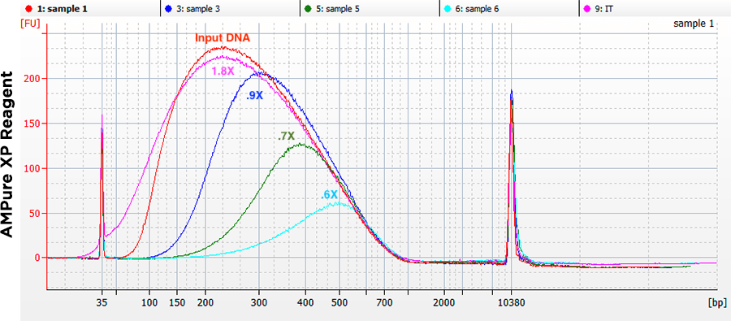
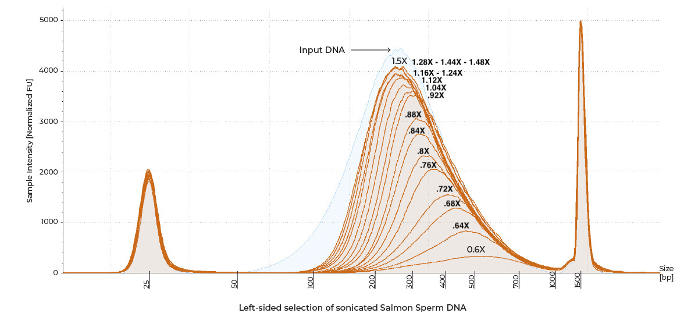

# DNA sequencing
## Overview
### Options
- **Sanger** sequencing
- **Illumina** – for short reads. Can be done either at our core facility or sent to EMBL's Genecore. Options:
	- NextSeq: 2 x 100 bp reads (most common)
	- MiSeq: 2 x 150 bp reads, but fewer samples and reads than NextSeq
- Oxford **Nanopore** – for long reads (but few reads overall). Typically done for whole plasmids and amplicons via [SeqVision](https://seqvision.com/).
- **PacBio** – for long reads. Can be done at out core facility.
## Illumina sequencing preparation via PCR
An easy way to prepare samples for NGS is to amplify your DNA with primers that already contain the required adaptors and barcodes.
### Forward primer
It should look like this:

5' - P5 - SP1 - Plasmid site 2' - 3',

where:

- **P5:** AAT GAT ACG GCG ACC ACC GA TCT – attaches to the flowcell during sequencing;
- **SP1:** A CAC TCT TTC CCT ACA CGA CGC TCT TCC GAT CT (Read 1 Sequencing Primer);
- **Plasmid site 2':** A reverse complement of the site on the plasmid where the primer attaches.

Thus, the sequence is:

AAT GAT ACG GCG ACC ACC GA GA TCT - A CAC TCT TTC CCT ACA CGA CGC TCT TCC GAT CT - ...
### Reverse primer
It should look like this:

5' - P7 - **Barcode** - SP2' - Plasmid site 1 - 3',

where:

- **P7:** CAA GCA GAA GAC GGC ATA CGA GAT – attaches to the flowcell during sequencing;
- **Barcode:** A unique identifier to know which sample was yours in a pooled sequencing; must be unique across all samples that are submitted for sequencing;
- **SP2':** CAA GCA GAA GAC GGC ATA CGA GAT (Read 2 Sequencing Primer) – a reverse complement of the SP2 sequence.

Thus, the sequence is (assuming the barcode is TGT ATT):

CAA GCA GAA GAC GGC ATA CGA GAT - **TGT ATT** - GTG ACT GGA GTT CAG ACG TGT GCT C - ...
### Design details
- You want to have primers end with **one or two G's or C's**, but not more.
- Check in Benchling for primer dimers. If **delta G < -7 kcal/mol**, this is already becoming risky.
- **Sequence diversity** will be low at the beginning for each read. Consider adding **PhiX** to resolve chip failures.
## NEBNext Ultra II DNA Library Prep Kit for Illumina
### Overview

NEBNext Adaptor for Illumina sequence:

**5´-/5Phos/** GAT CGG AAG AGC ACA CGT CTG AAC TCC AGT C **dU** A CAC TCT TTC CCT ACA CGA CGC TCT TCC GAT **C-s-T-3´**

Final sequences that we submit for sequencing:

5'-P5-SP1-Sequence-SP2-Barcode'-P7'-3'
5'-P5-SP2-Sequence'-SP1-Barcode'-P7'-3'

where:

- P5: AAT GAT ACG GCG ACC ACC GA – attaches to the flowcell during sequencing;
- SP1: A CAC TCT TTC CCT ACA CGA CGC TCT TCC GAT C**T** (Read 1 Sequencing Primer);
- SP2: GAC TGG AGT TCA GAC GTG TGC TCT TCC GAT C**T** (Read 2 Sequencing Primer);
- P7: CAA GCA GAA GAC GGC ATA CGA GAT – attaches to the flowcell during sequencing.

The following sequences are used for adaptor trimming of NEBNext adaptors for Illumina:

- Read 1: **A** GAT CGG AAG AGC ACA CGT CTG AAC TCC AGT CA - SP2 **plus an additional A from somewhere**;
- Read 2: **A**G ATC GGA AGA GCG TCG TGT AGG GAA AGA GTG T - SP1'.

A schematic tracking all sequences and their orientations:

### General guidelines
- All **pipetting up and down** must be done at least **10 times** to mix very well. The presence of a small amount of bubbles will not interfere with performance.
- Always spin down PCR tubes after incubation in a thermocycler for 1 min. Use the fixed-speed microcentrifuge that you typically use to spin down tubes.
### Sample Tracking Sheet

| Step              | Qubit concentration (ng/uL) | Vol. (uL) | Milli-Q  | Amount (ng) | Notes                                |
| ----------------- | --------------------------- | --------- | -------- | ----------- | ------------------------------------ |
| End repair        | [C1]                        | V         | to 50 uL | [C1] x V    | Ideally 1 ug, but no less than .5 ng |
| Barcoding         | [C2]                        | 15        | -        | [C2] x 15   | Barcode:                             |
| Final preparation | [C3]                        | 19        |          | [C3] x 19   |                                      |

### End repair (90 min)
1. Get sample concentrations using Qubit High Sensitivity kit and record them in the Sampel Tracking Sheet.
2. Transfer between .5 ng and 1 ug (ideal) of DNA to PCR tubes and adjust volume to 50 uL with Milli-Q.
3. Prepare master mix **on ice** in a .5 mL LoBind tube and pipette it **gently** up and down:

| Component                                                 | Per reaction (uL) | Per reaction + 5% (uL) |
| --------------------------------------------------------- | ----------------- | ---------------------- |
| End Prep Reaction Buffer | 7                 | 7.35                   |
| End Prep Enzyme Mix      | 3                 | 3.15                   |
| **Total**                                                 | 10                | 10.5                   |

4. Add **10 uL of master mix** to each DNA sample and pipette up and down.
5. **Incubate** in a thermocycler (60 uL):

| Step                | Temperature | Time (min) |
| ------------------- | ----------- | ---------- |
| Incubation          | 20          | 30         |
| Enzyme inactivation | 65          | 30         |
| Hold                | 4           | Hold       |

6. **Spin down** for 1 min.

### Adaptor ligation (45 min)
1. Thaw [NEBNext Adaptor Dilution Buffer](https://www.neb.com/en/products/b1430-nebnext-adaptor-dilution-buffer).
2. In the meantime, prepare Master Mix **on ice** in a  .5 mL LoBind tube:

| Component                                                | Per reaction + 10%(uL) |
| -------------------------------------------------------- | ---------------------- |
| NEBU2 Ligation Master Mix | 15.4                   |
| NEBU2 Ligation Enhancer   | 1.1                    |

3. Add **15 uL of Master Mix** to each DNA sample.
4. You'll need **2.3 uL** per sample of **diluted NEBNext Adaptor**. Dilute NEBNext Adaptor (from the Index Kit) with NEBNext Adaptor Dilution Buffer according to the DNA amount you have, making sure the final diluted volume is sufficient for all your samples.

| DNA amount (ng) | Dilution |
| --------------- | -------- |
| <5              | 25       |
| 5-100           | 10       |
| 101-1000        | 1        |

5. Add **2.3 uL of NEBNext Adaptor (diluted, Step 4)** to each sample, pipette up and down **gently** and spin down.
6. **Incubate for 15 min** at room temperature or an open-lid thermocycler set to 20C.
7. Add **3 uL of USER enzyme** and gently pipette.
8. Incubate in a thermocycler (80.3 uL):

| Step       | Temperature | Time (min) | Lid temperature |
| ---------- | ----------- | ---------- | --------------- |
| Incubation | 37          | 15         | 47              |
| Hold       | 4           | Hold       |                 |

14. Spin down for 1 min.
	- You may take a break here and store samples at -20C until ready.
### Magnetic bead purification (45 min)
1. Let the magnetic beads thaw to **room temperature**, then vortex.
2. Transfer PCR products to a new 1.5 mL tube.
3. Choose bead/sample **ratio** based on the your fragment size in the chart below.
	- After adaptor ligation, the fragment size increases by 66 nt
	- After barcoding, another 66 nt are added
	- NEB uses a rough estimate of 120 nt being added
	- For [AMPure XP beads](https://www.beckman.com/reagents/genomic/cleanup-and-size-selection/pcr/bead-ratio):
		
	- For [Zymo Select-a-size MagBeads](https://files.zymoresearch.com/protocols/_d4084_d4085_select-a-size_dna_clean_concentrator_magbead_kit.pdf):
		

| Round | Input from                          | Input vol (uL) | Bead vol. (uL) | Amount of water for resuspention (uL) | Amount of sample to transfer (uL) |
| ----- | ----------------------------------- | -------------- | -------------- | ------------------------------------- | --------------------------------- |
| **1** | Adaptor ligation                    | 80.3           | 80.3 x ratio   | 23                                    | 20                                |
| **2** | Barcoding                           | 50             | 50 x ratio     | 53                                    | 50                                |
| **3** | Magnetic bead purification, Round 2 | 50             | 50 x ratio     | 23                                    | 20                                |

3. Add the computed **bead amount** to each sample and pipette up and down.
4. **Incubate** at room temperature for 5 min.
5. In the meantime, make fresh **80% ethanol** (need 200 uL x 2 times x 3 rounds = 1.2 mL per sample):

| Component    | Per reaction + 5% (mL) |
| ------------ | ---------------------- |
| 100% ethanol | 1.01                   |
| Milli-Q      | .25                    |

6. Place the strip tube inside the magnet rack until supernatant is **clear** (~5 min), then remove and **discard the supernatant**, ensuring no beads are discarded.
7. Keeping the plate on the magnet, **add 200 uL** freshly prepared 80% ethanol to each sample, wait **30 seconds**, and **discard** ethanol.  
8. **Repeat** the previous step. 
9. **Draw out** any remaining ethanol with a 10 uL pipette. 
10. **Air-dry** beads for **7 minutes** at room temperature on the magnet with the lids open, but do not let the beads dry out.
	 - The beads should look brown and glossy. If they look light brown and cracked, you've dried them for too long. This may result in the loss of the recovered DNA amount.
11. Remove the strip of tubes from the magnet and add **23 uL** (or **53 uL** in Round 2) of **water** to each sample to re-suspend the beads, pipette, and incubate at room temperature for 2 minutes.
12. Place the strip to the magnet until supernatant is clear (~5 minutes).  
13. Transfer **20 uL** (or **50 uL** in Round 2) of each sample to new tubes (PCR tubes for barcoding or 1.5 mL tubes for purification rounds 2 and 3), making sure not to transfer any beads. 
### Barcoding (45 min)
1. Use Qubit High Sensitivity kit to determine DNA concentration, using **5 uL** of each sample and a high sensitivity dye.
	- 15 uL remain for barcoding.
	- Record concentrations in the Sample Tracking Sheet.
2. Do one of the following:
	1. If using ==96 Index Primers== (from a 96-well plate):
		4. Thaw the NEBNext Index/Universal Primer Mix plate for **10-15 min** at room temperature.
		5. Remove the hard plastic plate cover. Briefly **centrifuge** the plate (280 × g for ~1 min) to collect all of the primer at the bottom of each well.
		6. Using a pipette, add **25 µL** of NEBNext Ultra II Q5 Master Mix into each sample.
		7. Add **10 uL of indexed primer** from the plate to each sample.
			- The mix contains both a universal i5 primer and a specific i7 primer.
			- Note down the i7 barcodes used in the Sample Tracking Sheet.
	2. If using an ==Index Primer Set== (from individual tubes containing a single index):
		1. Prepare a **Master Mix**.
		2. Add **30 uL of the Master Mix** into each sample.
		3. Choose your Index (i7) primers from an Index Primer Set, note them down, add **5 uL** to each sample, and pipette up and down.

| Component                                                      | Per reaction (uL) | Per reaction + 5% (uL) |
| -------------------------------------------------------------- | ----------------- | ---------------------- |
| NEBNext Ultra II Q5 Master Mix | 25                | 26.25                  |
| Universal (i5) primer          | 5                 | 5.25                   |
| **Total**                                                      | 30                | 31.5                   |

3. Incubate in a thermocycler (50 uL):

| Stage | Name                 | Temperature | Duration (sec) | Number of cycles |
| ----- | -------------------- | ----------- | -------------- | ---------------- |
| 1     | Initial Denaturation | 98          | 30             | 1                |
| 2     | Denaturation         | 98          | 10             | See table below  |
| 2     | Annealing            | 65          | 75             |                  |
| 3     | Final Extension      | 65          | 300            | 1                |
| 3     | Hold                 | 4           | Hold           | 1                |

| Total DNA amount (ng) | Number of PCR Cycles |
| --------------------- | -------------------- |
| 0.5-10                | 12                   |
| 10-99                 | 8                    |
| 100-499               | 6                    |
| 500-1000              | 4                    |

5. Spin down for 1 min.
	- You may take a break here and store samples at -20C until ready.
### Final preparation
1. Purify with magnetic beads again **twice** (Rounds 2 and 3)
2. Check the concentration with the Qubit High Sensitivity kit high sensitivity dye before proceeding to Bioanalyzer.
	- Record concentrations in the Sample Tracking Sheet.
3. Dilute samples to **about** 1 ng/uL.
4. Run 1 uL of each sample on an Agilent Bioanalyzer High Sensitivity DNA chip. After the run, export the ladder and each of your samples as a csv file in order to produce a plot with the measured peaks.
5. Complete information in the [Sequencing projects](https://teams.microsoft.com/l/entity/2a527703-1f6f-4559-a332-d8a7d288cd88/_djb2_msteams_prefix_3009763277?context=%7B%22channelId%22%3A%2219%3A49f82e21dca44ba4b23edeec1b23e81d%40thread.tacv2%22%7D&tenantId=82c51a82-548d-43ca-bcf9-bf4b7eb1d012) tab and in the Genecore submission form (where Server name = Enzyme_library_S1_time)
6. Provide **about 2 ng** of each of your sample for sequencing (using Bioanalyzer's estimated concentration of everything but the markers).
7. Store the final samples at -20C.
## Resources
- [Source protocol](https://www.neb.com/en/-/media/nebus/files/manuals/manuale7103-e7645.pdf?rev=de09eaf8fcdf45e0ac8a66bf6fee75fb&hash=FC51B96E7568B4482CF1B5217EF04E31)
- [Improved Protocols for Illumina Sequencing - PMC](https://pmc.ncbi.nlm.nih.gov/articles/PMC3849550/)
- [Illumina\_Sequencing\_Overview\_15045845\_D.pdf](https://cbiit.github.io/brownbag-science/02-sequencing/Illumina_Sequencing_Overview_15045845_D.pdf)
- [Index primers](https://www.neb.com/en/-/media/nebus/files/manuals/manuale7500.pdf?rev=85c8e2b347844ca58281c17372fdcec4&hash=DA80FEE9917B41B5601425B44E60250F)
- [NEBNext® Multiplex Oligos for Illumina® (96 Index Primers)](https://www.neb.com/en/-/media/nebus/files/manuals/manuale6609.pdf?rev=9099f513158844a99030168ab2151f4f&hash=0AC74DC8AEDBDA2A78B65E69D9EC0337)