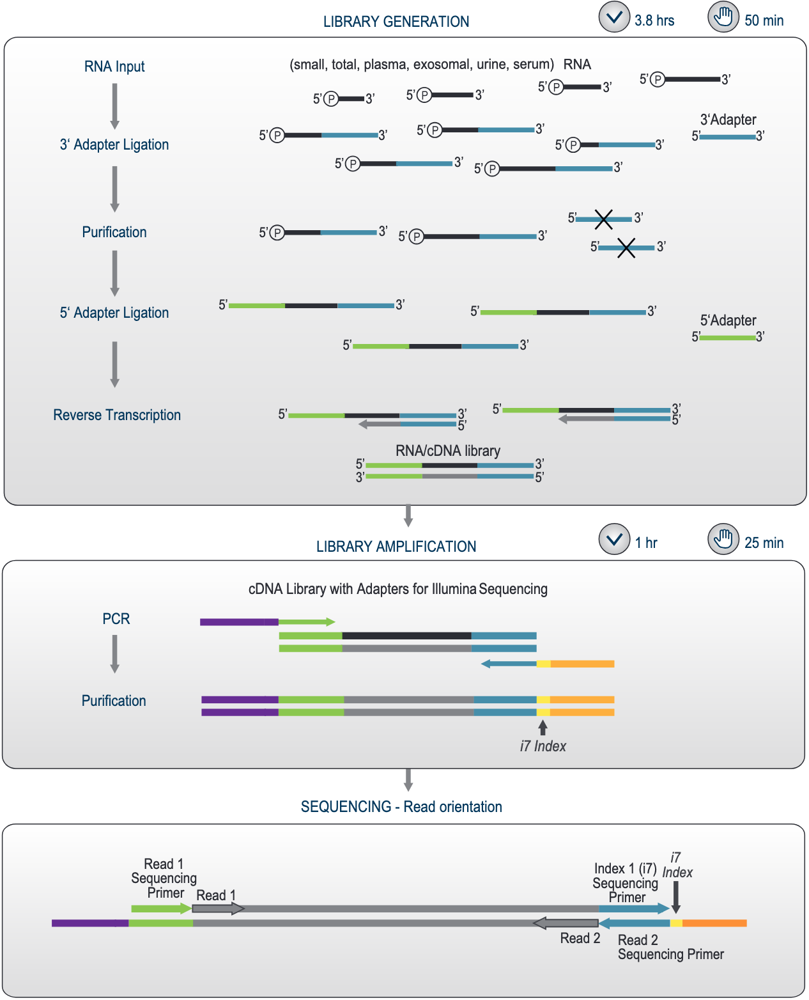

# RNA NGS preparation
## Overview
We use [Lexogen Small RNA-Seq Library Preparation Kit](https://www.lexogen.com/wp-content/uploads/2022/11/052UG128V0120_Small-RNA-Seq-Library-Preparation-Kit_2022-11-14.pdf) for sequencing short RNAs, like gRNAs.

- Final product composition:
	- P5 (23 nt): AATGATACGGCGACCACCGAGAT
	- SP1 (sequencing primer; also called an adaptor or a linker; 32 nt): CTACACGTTCAGAGTTCTACAGTCCGACGATC
	- Your sequence
	- SP2 (sequencing primer; also called an adaptor or a linker; 33 nt): TGGAATTCTCGGGTGCCAAGGAACTCCAGTCAC
	- i7 (6 nt): Listed in the Lexogen manual. If an 8 nt i7 index needs to be entered into an Illumina sample sheet, e.g., if libraries are multiplexed with other 8 nt index libraries, add two nucleotides from the Illumina adapter sequence to the 3’ end of the i7 index sequence (i.e., P7). Example: SRi7001 would become CAGCGT**AT**, SRi7002 would become GATCAC**AT** and so on.
	- P7 (24 nt): ATCTCGTATGCCGTCTTCTGCTTG
- Linker-linker artifacts result in ~65 bp sequences (32 + 33) and ~120 bp (65 + 23 + 24), thus in Bioanalyzer we should only look at fragments >120 bp in length.
### A3, A5, and RTP dilution, ethanol and PCR cycles adjustments

| Input RNA amount | Dilution factor | Ethanol (uL), Step 5 | Number of PCR cycles |
| ---------------- | --------------- | -------------------- | -------------------- |
| 100 - 1000 ng    | 1X              | 50 (optional: 100)   | 12-15                |
| 1 - 100 ng       | .5X             | 50                   | 16-20                |
| 50 pg - 1 ng     | .5 to .3X       | 50                   | 20-22                |

## Upon receiving the kit
- Aliquot PCR mix into PCR tubes with 55 uL each.
- Add 90 mL of 100% ethanol to CW and shake to combine.
## Procedure
- All steps carried out at 20-25C.
- Thaw all buffers to room temperature unless indicated otherwise. Vortex or pipette briefly and spin down before opening.
- If white precipitate is visible in CB or CW, incubate them at 37C until buffer components dissolve completely.
- Thermocycler lid: 105C.
### 3' Adapter Ligation
Thaw **water, A3, and LM1** to room temperature.

1. Dilute A3 according to the **Dilution factor** in the table above. If you have **n** samples, make sure you get at least **n** uL of the diluted A3.
2. Dilute input RNA with nuclease-free **water** to **6 uL**.
3. Add **1 uL** of diluted **A3**.
4. **Denaturing:** Incubate for 2 min at 70C **preheated** thermocycler and place **on ice**.
	- Total volume: 7 uL.
	- Spin down before opening.
5. Master Mix (mix well and spin down)

| Component                                                                               | Per reaction (uL)     | Per reaction + 10% (uL) |
| --------------------------------------------------------------------------------------- | --------------------- | ----------------------- |
| Ligation Mix 1 (LM1) | 12                    | 13.2                    |
| Enzyme Mix 1 (E1)    | 1                     | 1.1                     |

6. Add **13 uL of Master Mix** to the RNA/A3 sample and incubate at **28C for 1 h**.
	- Total volume: 20 uL.
	- Mix well and spin down.
7. Store at -20C if needed.
### Removal of Excess 3' Adapter
- Pre-cool centrifuge to 18C.

1. Transfer 3' adapter ligation reaction (20 uL) to 1.5 mL tube.
2. Add **300 uL** Column Binding Buffer (**CB**).
	- Mix well by pipetting.
3. Add **50 uL** (adjust based on the table at the top) of **100% EtOH** and mix well.
4. Transfer onto a Purification Column placed in a 2 mL Collection Tube.
5. Centrifuge for **1 min at 3500 g** (~6000 rpm) at **18C**.
6. **Discard flow-through.**
7. Add **600 uL** Column Wash Buffer (**CW**) and centrifuge for **1 min at 14000 g** (~12000 rpm) at **18C**.
8. **Discard the flow-through.**
9. Centrifuge for **2 min** at **14000 g** (~12000 rpm) at **18C** to dry the column.
10. Transfer to a new 1.5 mL tube and add **12 uL** Elution Buffer (**EB**).
11. Centrifuge for **1 min at 200 g** (~1400 rpm) at **18C**.
12. Centrifuge for **2 min at 14000 g** (~12000 rpm) at **18C** to elute 3' adapter-ligated RNA.
13. Transfer the eluate into an PCR tube.
	- Note that at this point Qubit measurement of the concentration may not indicate the true concentration of the ligated product.
### 5' Adapter Ligation
Thaw **water, A5, and LM2** to room temperature.

1. Dilute A5 according to the **Dilution factor** in the table above. If you have **n** samples, make sure you get at least **n** uL of the diluted A5.
2. **Denaturing:** Incubate for 2 min at 70C **preheated** thermocycler and place **on ice**.
	- Spin down before opening.
3. Master Mix (mix well and spin down):

| Component                                                                           | Per reaction (uL) | Per reaction + 10% (uL) |
| ----------------------------------------------------------------------------------- | ----------------- | ----------------------- |
| 5' Adapter (A5)      | 1                 | 1.1                     |
| Ligation Mix 2 (LM2) | 11                | 12.1                    |
| Enzyme Mix 2 (E2)    | 1                 | 1.1                     |

4. Add **13 uL of Master Mix** to the RNA/A3 sample and incubate at **28C for 1 h**.
	- Total volume: 25 uL.
### Reverse Transcription of Ligated RNA
Thaw RTP and FS to room temperature.

1. Dilute Reverse Transcription Primer (**RTP**) according to the **Dilution factor** in the table above. If you have **n** samples, make sure you get at least **n** uL of the diluted RTP.
2. Add 1 uL diluted RTP to the finished 5' adapter ligation reaction.
	- Mix well and spin down.
3. **Denaturing:** Incubate for 2 min at 70C **preheated** thermocycler and place **on ice**.
	- Spin down before opening.
4. Master Mix (mix well and spin down):

| Component                                | Per reaction (uL)     | Per reaction + 10% (uL) |
| ---------------------------------------- | --------------------- | ----------------------- |
| First Strand cDNA Synthesis Mix (**FS**) | 8                     | 8.8                     |
| Enzyme Mix 3 (**E3**)                    | 1                     | 1.1                     |

5. Add **9 uL of Master Mix** to the denatured reaction product and incubate in a pre-heated thermocycler at **50C for 1 h**.
	- Total volume: 35 uL.
6. Spin down.
7. Store at -20C if needed.
### Library Amplification
Thaw PCR, P5, indices, and water to room temperature.

1. Spin down the Small RNA i7 Index Primer (SRi7001-7096) plate
	- In [Biosan CVP-2](https://biosan.lv/products/cvp-2/), Use Quick Spin button or run 1000 rpm for spin and 300 rpm for vortex for 1 min ottal).
	- Make sure to counterbalance the plate with another plate, not with adapters that are placed in the centrifuge/vortex device.
	- Check that you see liquid at the bottom.
	- Reseal opened wells to prevent cross contamination.
2. Master Mix (mix well and spin down):

| Component                                                                    | Per reaction (uL)     | Per reaction + 10% (uL) |
| ---------------------------------------------------------------------------- | --------------------- | ----------------------- |
| PCR Mix (PCR)  | 50                    | 55                      |
| P5 Primer (P5) | 3                     | 3.3                     |
| Nuclease-free water                                                          | 11                    | 12.1                    |
|                                                                              | **Number of samples** | **1**                   |

2. Add 64 uL Master Mix to 33 uL sample.
3. Add 3 uL of indices, mix well and spin down.
4. Conduct thermocycling, using the number of cycles based on the table above:

| Stage | Cycle step           | Temperature (°C) | Time (s) | Cycles |
| ----- | -------------------- | ---------------- | -------- | ------ |
| 1     | Initial denaturation | 98               | 30       | 1      |
| 2     | Denaturation         | 98               | 10       | 12-22  |
|       | Annealing            | 60               | 30       |        |
|       | Extension            | 72               | 15       |        |
| 3     | Final extension      | 72               | 10 min   | 1      |
|       | Incubation           | 10               | Hold     | Hold   |

### Purification
1. Transfer the finished PCR reaction (~100 uL) to a 1.5 mL tube.
2. Add **300 uL** Column Binding Buffer (**CB**), mix well by pipetting.
3. Add **50 uL** 100% ethanol **to** the reaction, mix well.
4. Transfer onto a Purification Column in a 2 mL Collection Tube.
5. Centrifuge for **1 min at 3500 g** (~6000 rpm) at **18C**.
6. **Discard flow-through.**
7. Repeat twice:
	1. Add **600 uL** Column Wash Buffer (**CW**) and centrifuge for **1 min at 14000 g** (~12000 rpm) at **18C**.
	2. **Discard the flow-through.**
8. Centrifuge for **2 min** at **14000 g** (~12000 rpm) at **18C** to dry the column.
9. Transfer to a new 1.5 mL tube and add **20 uL** Elution Buffer (**EB**).
10. Centrifuge for **1 min at 200 g** (~1400 rpm) at **18C**.
11. Centrifuge for **2 min at 14000 g** (~12000 rpm) at **18C** to elute 3' adapter-ligated RNA.
12. Transfer the eluate into an PCR tube.