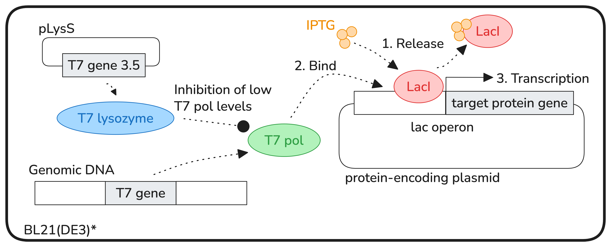

# Protein production
## Overview

A large amount of protein can be produced by introducing a protein encoding plasmid into a BL21(DE3)* *E. coli* strain containing a DE3 element that expresses T7 RNA polymerase.

In this setup, the gene must be under a T7 promoter in the *lac* operon. Protein production is induced with IPTG that binds LacI (lac repressor) and thus opens up RNA polymerase's access to the promoter. IPTG is not consumed and thus protein production remains stable. In practice, a lacUV5 promoter is used, which is stronger that the wild-type lac promoter. IPTG needs to be optimized in order to balance the amount of protein produced in such a way that it does not overwhelm a cell.

Protein production can further be stabilized by introducing a pLysS plasmid that constitutively expresses low levels of a T7 lysozyme. T7 lysozyme inhibits basal levels T7 RNA polymerase, thus protein expression is suppressed even if the T7 promoter is leaky. This is especially useful the the protein is toxic to the host cell.

Protein production is typically done in two phases:
1. Biomass growth at optimal conditions (37C)
2. Protein production at less favorable conditions (e.g., 16C)

When the amount of the resulting protein is unknown a priori, it is recommended to grow about 3 L of medium to obtain a large amount of biomass in a single run and have enough material even for small amounts of protein.
## Reagents and materials
### Materials
Note that the protocol is set up for 8 flasks. This may seem as an overkill but it saves you from running the procedure again in case your protein of interest is poorly expressed.

| Day | Material                                                           | Vol.   | Quantity | Purpose                      |
| --- | ------------------------------------------------------------------ | ------ | -------- | ---------------------------- |
| 1   | Dual-antibiotic plate (CHL + specific antibiotic for your plasmid) |        | 1        | Plating                      |
| 2   | Conical flask                                                      | 2 L    | 8        | TB                           |
|     | Conical flask                                                      | 500 mL | 1        | TB                           |
|     | Small bottle                                                       | 500 mL | 1        | TB for dilutions             |
|     | Bottle                                                             | 1 L    | 1        | 10X phosphates               |
|     | Serological pipette                                                | 25 mL  | 1        | 10X phosphates               |
| 3   | Conical falcon tube                                                | 500 mL | 4        | Pelleting                    |
|     | Serological pipette                                                | 50 mL  | 1        | 10X phosphates               |
|     | Serological pipette                                                | 5 mL   | 1        | Culture                      |
|     | Cuvette                                                            | 1 mm   | 5        | OD measurements              |
|     | Eppendorf microtube                                                | 1.5 mL | 2        | Culture samples for SDS PAGE |

### Reagents
- CHL – 8 x 400 uL -> 3.5 mL
- CB – 8 x 400 uL -> 3.5 mL
- 1 M IPGT – 8 x 40 uL -> 350 uL
### TB media

| Component     | Amount to get | Final conc. (g/L) |
| ------------- | ------------- | ----------------- |
| Yeast extract | 74.4 g        | 24                |
| Tryptone      | 37.2 g        | 12                |
| Glycerol      | 15.62 g       | 5.04              |
| dH2O          | up to 3.1 L   |                   |

1. Combine in a large plastic container with a handle – it will make it easier to pour.
2. Initially dilute in a smaller volume (e.g., 80%) and stir by hand until the powders have fully solved. It will look like beer with a bit of foam.
3. Add the remaining water.
4. Autoclave at 1/20' (121C).
### 10X phosphates

| Component | Amount to get | MW (g/mol) | Final conc. (M) |
| --------- | ------------- | ---------- | --------------- |
| KH2PO4    | 9.25 g        | 136.09     | .17             |
| K2HPO4    | 50.16 g       | 174.18     | .72             |
| dH2O      | up to 400 mL  |            |                 |

- Filter sterilize or autoclave at 1/20' (121 C).
- Mixing phosphates with TB before autoclaving may yield precipitation. Typically still works but most conservative practice is to add sterilized/autoclaved phosphates to the TB on the day of usage.

## Procedure
### Day 1: Transformation *(optional)*
1. In the evening, **transform** the plasmid containing protein-expressing gene into Bl21(DE3)* pLysS and plate on a **dual-antibiotic plate** with CHL (for pLysS) and the specific antibiotic for your plasmid.
### Day 2: Overnight growth
1. *(Optional)* In the morning, pick a colony from the transformation plate and spread it on a **fresh dual-antibiotic plate** (CHL + specific antibiotic).
2. **Prepare TB** medium components:
    1. **Autoclave TB medium** (without phosphates):
	    1. 360 mL per 2 L flask (8 flasks total),
	    2. 90 mL for the overnight culture in a 500 mL flask.
	    3. The remaining TB volume (~100 mL) in a small bottle (for OD600 measurements).
    2. Prepare **10X phosphates** solution (KH2PO4 and K2HPO4). Autoclave them separately (or add them to the TB medium via a filter on the day of use).
3. In the evening, to the **90 mL TB medium** flask add:
	1. **10 ml of 10X phosphates**;
	2. **100 uL of CHL** (for pLysS);
	3. **100 uL of the specific antibiotic** for your plasmid.
4. Set up overnight culture in the TB flask.
### Day 3: Biomass growth (3-4 hours)
1. Make sure the overnight culture has grown (should look cloudy).
2. Outgrowth:
	1. To each **2 L flask** with TB medium add:
		1. **40 mL 10X phosphates**;
		2. **400 uL of CHL** (for pLysS);
		3. **400 uL of the specific antibiotic** for your plasmid.
	2. Transfer 1 mL from one of the medium flasks to a **cuvette** for blanking. Cover with foil.
	3. Add **4 mL overnight culture** to each 2 L flask.
	4. Measure the **initial OD600** by sampling from one 2 L flask.
	5. Grow in a **shaker** (250 rpm, 37C) until reaching **OD600 .5-.6**.
		- Measure **every hour** and estimate when the required OD600 will be reached by computing the doubling time.
		- Start measuring more often closer to the target OD600 so that you don't overgrow. Cells grow fast in the log phase!
	6. Cool down to room temperature or lower before induction.
3. Protein production:
	1. **Put aside 1 mL** of the culture before induction for SDS-PAGE.
	2. Add **400 uL of 1 M IPTG** (final concentration – 1 mM) and grow shaking at 250 rpm. Choose the temperature and duration according to the properties of your protein, but a safe choice is 18C for 24 h.
		- Final IPTG concentration typically is between 100 uM and 1 mM and depends on your protein / plasmid.
### Day 4: Pelleting
1. Cool down the culture flasks at 4C for at least 10 min.
2. **Cool down centrifuge** to 4C and set **500 mL conical tubes under UV**.
3. Take **1 mL of the resulting culture**, **dilute** it 10X with 9 mL of TB medium, and **measure OD600**.
4. Take another **1 mL of the resulting culture** and **dilute** it to the same OD600 you had just prior the IPTG induction. **Put aside 1 mL** for SDS-PAGE.
5. Pelleting:
	1. Transfer into 4 x 500 mL **conical tubes** from 4 flasks, spin down for 12 min 4000 rpm at 4C, and discard supernatant.
		- Make sure you counterbalance them accurately by equalizing their weight.
		- Place the remaining flasks in 4C.
	2. Transfer the **remaining flasks** contents to the conical tubes (pouring on top of the pellet), spin down for 12 min 4000 rpm at 4C, and discard supernatant.
	3. **Weigh** a piece of aluminum foil, scrape all pellets onto it, **weigh** again, snap freeze it with **liquid nitrogen**, and place it in **-70C** until purification.
		- For less sensitive proteins, freezing at -20C (chest freezer) is ok.
		- You may also use a 50 mL falcon instead of foil but it is less convenient to scrape pellet into it.
6. Preparation for SDS-PAGE:
	1. **Spin down** culture samples that you put aside at **6000 rpm for 2 min** and discard supernatant.
	2. Resuspend with a small amount of Milli-Q and measure the total volume by aspiring with pipette.
	3. Add the correct proportion of **4X SDS loading dye** and heat at **98C for 5 min**.
	4. Freeze to -20C or run SDS-PAGE immediately.
## Resources
- [Protein Expression Protocol \| Popa Lab](https://popalab.uwm.edu/protein-expression-protocol/)
- [Regulating the T7 RNA polymerase expression in E. coli BL21 (DE3) to provide more host options for recombinant protein production \| Microbial Cell Factories](https://link.springer.com/article/10.1186/s12934-021-01680-6)