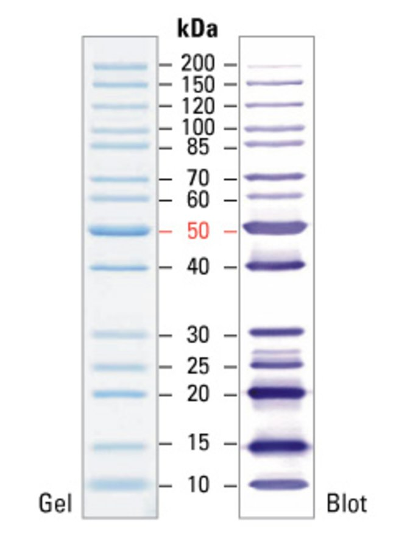
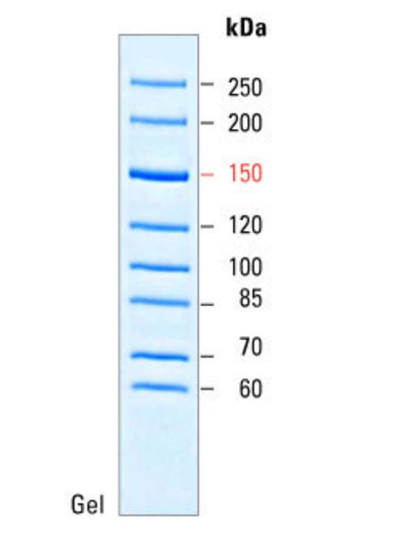
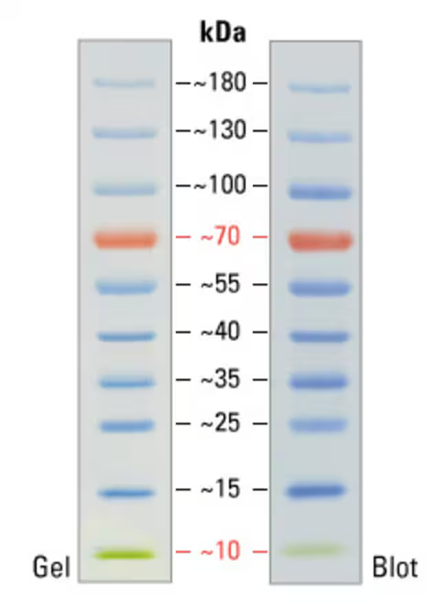

# SDS-PAGE
## Overview
SDS-PAGE (sodium dodecyl sulphate-polyacrylamide gel electrophoresis) is used protein separation based on weight. When a protein is boiled with a reducing agent (DTT or B-ME), disulphide bonds break down and the protein linearizes (18 Angstroms diameter). Then SDS coats the protein with a uniform negative charge (1.4 g SDS per 1 g protein), such that positive and negative charges of protein's R-groups are masked and net charge is negative and proportional to protein's molecular weight. SDS is also required in a gel to retain linearization and negative charge.

{width=50%}

When running the gel, negatively charged glycine ions enter the stacking gel, become mostly neutral due to pH 6.8, and start moving very slowly in the electric field. On the other hand, Cl- ions move very fast toward the anode, thus a narrow zone with a steep voltage gradient is formed between glycine and Cl-, where the proteins end up concentrating, leading to narrow bands in the resolving gel.

When resolving gel is reached, glycine becomes negatively charged and starts moving quickly. In contrast, the narrow band of proteins slows down due to the higher acrylamide concentration, and thus protein separation begins.

## Buffers
### 10X SDS running buffer
1X buffer has pH 8.3.

| Component | Amount (g) |
| --------- | ---------- |
| Tris      | 30.2       |
| Glycine   | 144        |
| SDS       | 10         |
| dH2O      | To 1 L     |
### 4X Tris-HCl buffer

|          | Resolving (pH 8.8) | Stacking (pH 6.8) |
| -------- | ------------------ | ----------------- |
| Tris     | 91 g               | 6.05 g            |
| dH2O     | 300 mL             | 40 mL             |
| HCl (1N) | To pH 8.8          | To pH 6.8         |
| dH2O     | To 500 mL          | To 100 mL         |
| SDS      | 2 g                | .4 g              |

### 4X Loading dye
Denatures proteins

| Component         | Amount    |
| ----------------- | --------- |
| Tris-HCl (pH 6.8) | 200 mM    |
| β-mercaptoethanol | 4% (V/V)  |
| SDS               | 80 g/L    |
| Glycerol          | 40% (V/V) |
| Bromophenol blue  | 8 g/L     |
### Staining/destaining solutions

| Component      | Staining (mL) | Destaining (mL) |
| -------------- | ------------- | --------------- |
| Brilliant Blue | 1 g/L         |                 |
| Ethanol (tech) | 400           | 100             |
| Acetic acid    | 100           | 75              |
| dH2O           | 500           | 825             |
### Resolving gel resolution

| **Size of protein (kDa)** | **% acrylamide in resolving gel** |
| ------------------------- | --------------------------------- |
| 4–40                      | 20                                |
| 12–45                     | 15                                |
| 10–70                     | 12.5                              |
| 15–100                    | 10                                |
| 25-200                    | 8                                 |

## Gel preparation

1. Assemble clean glass plates in the gel casting apparatus. (Dirty plates will not seal properly. If the plates are clean, they can slide smoothly when rubbed together - any resistance indicates that they are not clean.)
2. Choose the appropriate **percentage of acrylamide** for the **resolving gel** based on your protein size (see the table above) and prepare the mix (stacking gel is always 4%):

/// tab | Calculations

| Component           | Stacking (mL) |
| ------------------- | ------------- |
| **Percentage**      | **P**         |
| 40% AA/BAA (37.5:1) | P x V / 40    |
| 4X Tris-HCl         | V / 4         |
| 10% APS (**uL**)    | V x 5         |
| TEMED (**uL**)      | V             |
| Milli-Q             | to **V**      |
///

/// tab | Example: 8% resolving

| Component            | Resolving (mL) | Stacking (mL) |
| -------------------- | -------------- | ------------- |
| **Percentage**       | **8**          | **4**         |
| 40% AA/BAA (37.5:1)  | 1              | .3            |
| 4X Tris-HCl (pH 8.8) | 1.25           |               |
| 4X Tris-HCl (pH 6.8) |                | .75           |
| dH2O                 | 2.75           | 1.95          |
| 10% APS (**uL**)     | 25             | 15            |
| TEMED (**uL**)       | 5              | 3             |
| **Total**            | **5**          | **3**         |
///

2. Pour the resolving gel mixture into the gel plates to a level **2 cm below the top** of the shorter plate. 
3. Pour **a layer of water** over the top of the resolving gel to prevent meniscus formation in the resolving gel.
	- The water will initially mix with the gel solution but eventually it will fractionate and you will see a faint separating line between the two layers.
4. Allow the resolving gel to stand at room temperature until solidified (~30 min).
5. Drain the water from top of the resolving gel and wick any remaining water away with a paper towel.
6. Prepare the stacking gel mix.
7. Pour stacking gel solution into gel plates (on top of the running gel), so that the gel plates are filled and a meniscus forms. Insert a comb, assuring no air is trapped between the comb's teeth.
8. Allow gel to stand at room temperature until solidified (~1 hr), or overnight at 4°C (wrapped in saran wrap or in the SDS running buffer). 
### Prepare samples
1. Mix the samples (~30 ug per well) with the 4X loading dye.
	1. 10 wells – 15 uL sample + 5 uL loading dye
	2. 15 wells – 9 uL sample + 3 uL loading dye
2. Incubate the samples at 98C for 5 min.
### Running the Gel
1. Remove comb and assemble cast gel into the Mini-Protean II apparatus. 
2. Add a freshly diluted 1x SDS running buffer (300 ml) to both chambers of the apparatus.
	- Do not pre-run. 
3. Load 5 uL of protein ladder.
4. Load the prepared samples into the wells of the gel.
5. Run on a constant current (35 mA for one mini-gel, 200 V) for ~50 mins (until bromophenol runs off).
## Staining & De-staining the Gel
[Source](https://assets.thermofisher.com/TFS-Assets/LSG/manuals/MAN0011813_PageBlue_Protein_Stain_Solution_UG.pdf)
Remove the run gel from the apparatus and remove the spacers and glass plates. Place the gel into a small tray and choose how you want to stain it.
### Option 1: Microwave
1. Repeat 3 times: Add **100 mL Milli-Q**, **microwave** for **60 sec**, gently **agitate for 4 min**, and **discard** water.
2. Add **PageBlue** Protein Staining Solution to **cover** the gel (~20 mL), microwave for 20-30 sec. Do not allow to boild
3. Gently **agitate for 20 min**.
4. Transfer the used staining solution to a bottle for a later use (up to 4 times total) and rinse the gel **2 times with Milli-Q**.
5. Repeat 3 times: Add **100 mL Milli-Q**, **microwave** for **60 sec**, gently **agitate for 4 min**, and **discard** water.
	- Washing the gel for a longer period (e.g., overnight) or frequently replacing the water will enhance sensitivity by reducing background.
	- Placing a folded Kimwipes Tissue in the container to absorb excess dye will accelerate the destaining process.
### Option 2: Traditional
1. Repeat **3 times**: Wash for **10 minutes** each using **100-200mL of Milli-Q** with gentle **agitation** and discard the water.
2. Add **PageBlue** Protein Staining Solution to **cover** the gel (~20 mL) and incubate at room temperature for **60 min** with gentle agitation.
	- Note: Gels may be stained overnight without increasing the background.
3. Discard the staining solution and rinse the gel **2 times with Milli-Q**.
	- Note: The staining solution can be saved and reused up to three additional times.
4. Wash the gel for **5 min with 100-200mL of Milli-Q**.
### Option 3: No PageBlue
1.  Add ~20 ml staining solution and stain for > 30 min with gentle shaking. 
2.  Pour off and save the stain. 
3.  Add ~5 ml de-stain solution and de-stain for ~1 min with gentle shaking. 
4.  Pour off and discard the de-stain solution. Add ~30 ml of de-stain solution. 
5.  De-stain with gentle shaking until the gel is visibly de-stained (>2 h). 
6.  Pour off and discard the de-stain solution. 
7.  Rinse with ddH2O. Add ~30 ml ddH2O and rinse for 5 min with gentle shaking. 
8.  Dry the gel on the gel dryer at 60°C for 1 h with a sheet of Whatman filter paper below the gel and a piece of Saran wrap over the gel.
## Ladders
### PageRuler™ Unstainder Protein Ladder
[Source](https://www.thermofisher.com/order/catalog/product/26614)

### PageRuler™ Unstained High Range Protein Ladder
[Source](https://documents.thermofisher.com/TFS-Assets/LSG/manuals/MAN0011748_PgRuler_Unstain_HiRnge_Protein_Lad_UG.pdf)

- Visualizes 60-250 kDa, 150 kDa band more intense
- Coomassie / silver stain / Western blot
- If new bands start appearing, add fresh DTT (100 mM final)

**Usage:**
1. Thaw and mix; no boiling.
2. Load 5 uL per well.

**Storage buffer:**
- 62.5 mM Tris-H3PO4 (pH 7.5)
- 1 mM EDTA
- 2% (w/v) SDS
- 100 mM DTT
- 1 mM NaN3
- 0.01% (w/v) bromophenol blue
- 33% (v/v) glycerol.

Store at -20C for up to one year.

### PageRuler™ Prestained Protein Ladder
[Source](https://documents.thermofisher.com/TFS-Assets/LSG/manuals/MAN0011772_PgRuler_Prestain_Protein_Lad_UG.pdf)

- Visualizes 10-180 kDa, 150 kDa band more intense
- Coomassie / silver stain / Western blot
- If new bands start appearing, add fresh DTT (100 mM final)

**Usage:**
1. Thaw and mix; no boiling.
2. Load 5 uL per well.

**Storage buffer:**
- 62.5 mM Tris-H3PO4 (pH 7.5)
- 1 mM EDTA
- 2% (w/v) SDS
- 10 mM DTT
- 1 mM NaN3
- 33% (v/v) glycerol.

Store at -20C for up to one year.

## Stains
### PageBlue™ Protein Staining Solution
- Coomassie G-250
- For polyacrylamide gels and polyvinylidene fluoride (PVDF) membranes
- 5-500 ng
- Can be reused for up to four times
- Fixing gel proteins with 25% isopropanol / 10% acetic acid solution or 12% trichloroacetic acid (TCA) for 15 minutes can increase staining sensitivity
