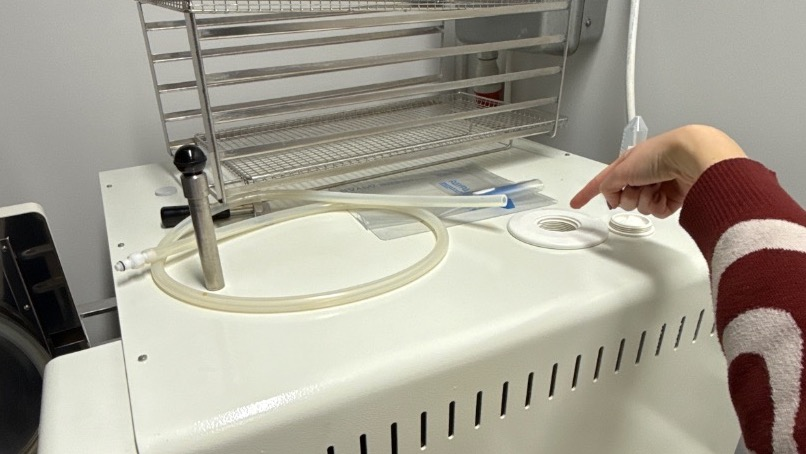

# Autoclaving
## Overview
Autoclave heats to 121C under 20 PSI without boiling, effectively killing *most* microbiological contaminants (bacteria and fungi). Used for sterilizing buffers, media, solid and liquid biological waste. Sterilization at 121C should last at least 20 min.

You can only autoclave solutions that do not contain heat-labile ingredients. If it does, use filter sterilization instead, at least for the non-autoclavable ingredient (and mix afterwards). Common non-autoclavable substances:

- SDS (boils over)
- Volatile/flamable organic solvernts (ethanol, phenol, chloroform, ...)
- Antibiotics, proteins, vitamins
- Glucose
- HEPES
- DTT
- Beta-mercaptoethanol

Containers:

- Borosilicate glass
- Polypropylene, but not polystyrene
- Pipette tips and their containers
- Microtubes

When autoclaving doesn't make sense:

- If you keep your autoclaved thing out in the open or for a prolonged time.
- When working with RNA. Use RNAse/DNAse-free tubes from manufacturer instead.
## Procedure
1. Prepare your items for autoclaving:
	1. Mark all your items with autoclaving tape and add date, contents, and your initials. The tape will show black stripes if exposed at 121C for at least 10 min.
	2. Cover all open items with aluminum foil.
	3. Never fill bottles more than halfway (to prevent boiling).
	4. Unscrew bottles one full round so that pressure doesn't build up.
2. Turn on the device.
3. Open the door by pulling out a metal rod.
4. Turn water on by turning a handle with a plastic tube on it.
	1. Water starts slowly filling in.
	2. Stop when it reaches the place indicated in red below (water starts coming of through the holes in the tray):
		.png)
	3. If there isn't enough water, pour in some more (1 L distilled water + 25 mL tap water) by opening a white lid at the top of the device. Make sure not to overfill by pouring above the metal plate inside the hole.
		
5. Choose program P3 (normally default, so no need to do *anything*).
6. Close the door, push the metal rod back in, and turn the handle until the door closes tightly. If done correctly, the display will change from "Door Open" to "SOL/LIQ-1".
7. Push start and wait for 1 h 20 min.
8. Carefully open the door – steam will come out! Take out your items (very hot) and place them nearby the device to cool down, then bring back to lab.
## Resources
- [Autoclave Sterilization | Barrick Lab](https://barricklab.org/twiki/bin/view/Lab/AutoclaveSterilization)