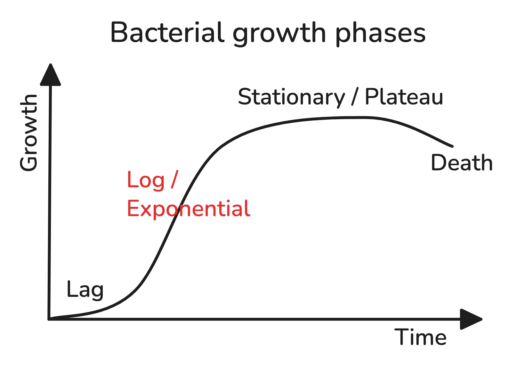
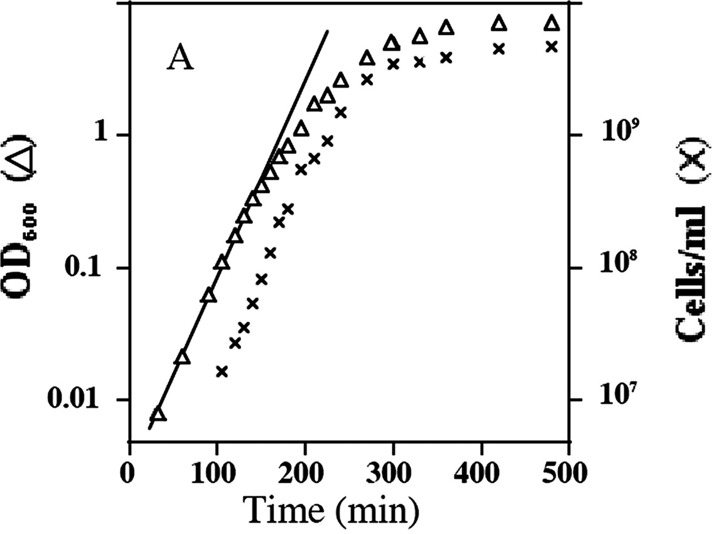

# Overnight culture
## Overview
{width=50%}

{width=50%}
([Sezonov et al., 2007](https://doi.org/10.1128/jb.01368-07))

When E. coli cells are inoculated in 5 mL of LB medium, shaking at ~200 RPM at 37C:

- **Easy carbon source depletion:** At OD600 = .3 cell mass starts to decrease, presumably due to the depletion of amino acids that are easy to utilize ([Escherichia coli Physiology in Luria-Bertani Broth - PMC](https://pmc.ncbi.nlm.nih.gov/articles/PMC2168924/)). It is also possible that the slow down is influenced by the lack of Mg2+ in the LB medium. If you want to increase Mg2+ availability, use the Mueller-Hinton or MOPS medium ([Small Things Considered: The Limitations of LB Medium](https://schaechter.asmblog.org/schaechter/2009/11/the-limitations-of-lb-medium.html)).
- **Mid-log phase:** OD600 = .5 in about 3-4 hours.
- **Stationary phase:** OD600 settles down at 2 or 3 in about 8-12 (10^9 cells/mL or .6 mg/mL dry weight).
## Materials
- Liquid LB medium – cold room, 4 mL (glass tubes with blue or black cap)
- Appropriate antibiotic – -20C fridge by the entrance, a box labelled "antibiotics":
	- Ampicillin: 50 µg/mL
	- Carbenicillin (a more stable ampicillin alternative): 50 µg/mL
	- Chloramphenicol (dissolve in EtOH): 35 µg/mL
	- Kanamycin: 50 µg/mL
- Bunsen burner
- Plate with colonies
- Toothpick
- 2 ml Eppendorfs – 2x
## Procedure
All steps are done behind a Bunsen burner (10 cm behind the flame).

1. Add **4 uL of antibiotic** to the 4 mL of LB medium (i.e., ratio 1:1).
2. Using a pipette tip **gently touch a colony** on a plate.
	- Even the slightest of touches will already contain enough colonies. You don't have to *see* the colony on the tip.
	- If using a frozen culture (from -70C), place the tube with the culture on ice, dip a loop / tip, then return the culture to -70C. For sensitive applications (e.g., competent cell preparation), best practice is to first inoculate on a plate and pick a single colony for the overnight culture.
	- Do not use the recovery from a transformation to immediately grow overnight culture. The transformation output contains a heterogenous population of plasmids and contaminants; plating recovery helps to get rid off them and focus on a single colony.
3. **Scrape off the tip** of the pipette into the **LB medium tube**.
4. Place in a **shaker** at 37C for 12-16 hours.
	- Keep the cap loose for aeration.
5. In the morning, the medium should look cloudy. Divide the liquid into:
	1. 500 uL, add 250 uL glycerol and 250 uL water (i.e., 25% glycerol in the end), and store in -70C for later usage.
	2. 1.6 mL in two **2 mL Eppendorfs** and spin at 17000 g briefly (<1 min).
6. Discard supernatant.
7. Proceed to plasmid purification. Expected yield: about 100 ng/uL.