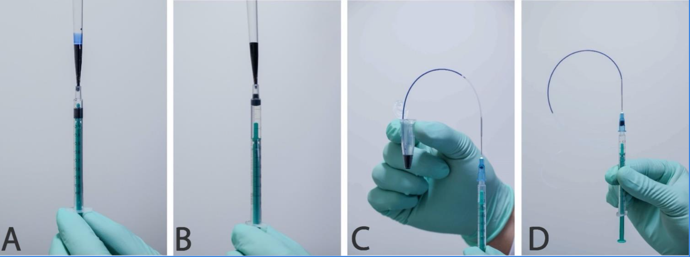
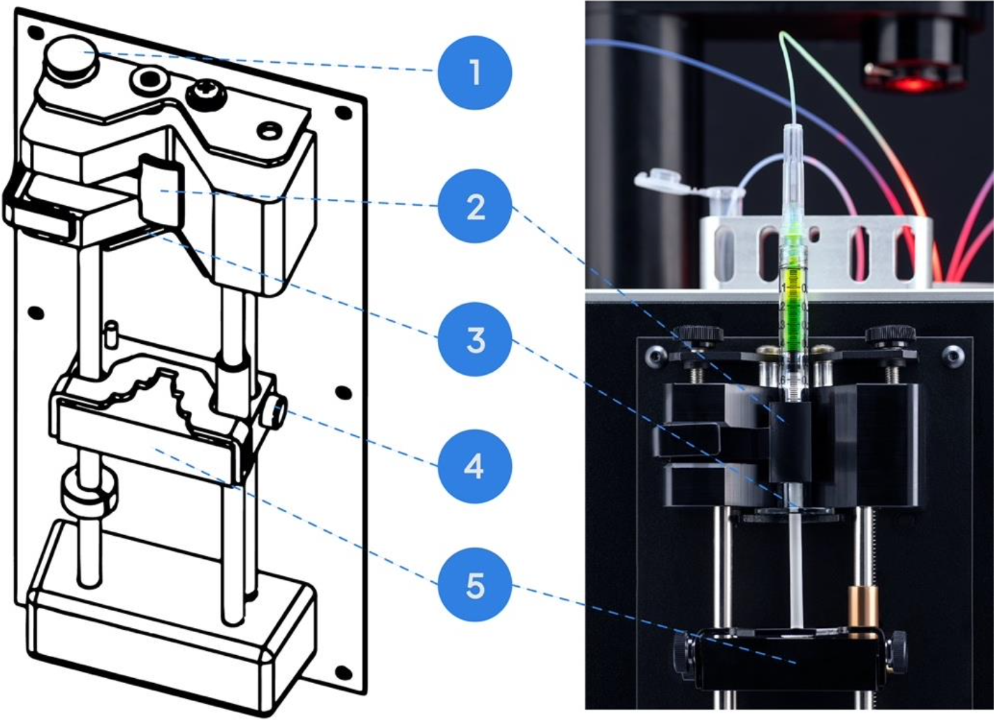

# Onyx
Onyx is used for generating droplets.
## Procedure
1. Loading into syringe:
	1. DSO: **600 uL** **Droplet stabilization oil**
	2. Sample:
		A. Samples > 300 uL: Load from the top slowly pulling the plunger
		B. Samples < 300 uL: Load 200 uL Sample loading oil, then add your sample
		C. Samples < 50 uL: Load 200 uL Sample loading oil, then draw your sample directly through the tubing.
	
2. For each syringe, gently push the plunger until some volume comes into the tubing and place them in the device:
	1. DSO – rightmost spot
	2. Sample – middle spot
	3. Outlet – leftmost spot
3. Attaching syringes:
	1. To make space for the syringe, push the latch release button (4) and move the pusher (5) downwards making space for the syringe with an extended plunger.
	2. Lift the syringe clamp (2).
	3. Place the syringe in the holder (3) and tighten the holder screws (1) for a secure fit.
	4. Secure the syringe clamp (2).
	5. Push the latch release (4) and move the pusher (5) close to the syringe plunger.
	

4. Priming: Hold the spacebar until the sample reaches the end of the tubing
5. Push the tubing into the chip, leaving a small gap at the bottom for the liquid to flow.
6. Set flow rates to get a diameter of 30-40 um:
	1. DSO: 300 uL/h
	2. Sample: 200 uL/h
7. Hit **Start**.
	- Wait for droplets to settle down in size before starting to collect them.
	- Check upstream where the droplets are being generated that there are no large air bubbles.
8. End of experiment:
	1. Stop the flow.
	2. Take out the tubes from the chip.
	3. Let the remained droplets go down the tube.
	4. Discard everything (sharps must be discarded separately).

## Rupture
1. Repeat twice: Add 5:1 volume of Sample Loading Oil to the sample, vortex briefly, discard the oil.
2. Add 1:1 volume of Emulsion Breaker to the emulsion, vortex for 30 s, spin down. Repeat again if the solution remains cloudy.
3. Recover the top (aqueous) phase.
## Pico injection
10. Connect the cord to CH1 at the back and place the electrode on the chip
11. Arrangement:
	1. Injection sample – 30 uL/h
	3. Sample (droplets) – 50 uL/h
	4. Spacing oil – 300 uL/h
12. Injection